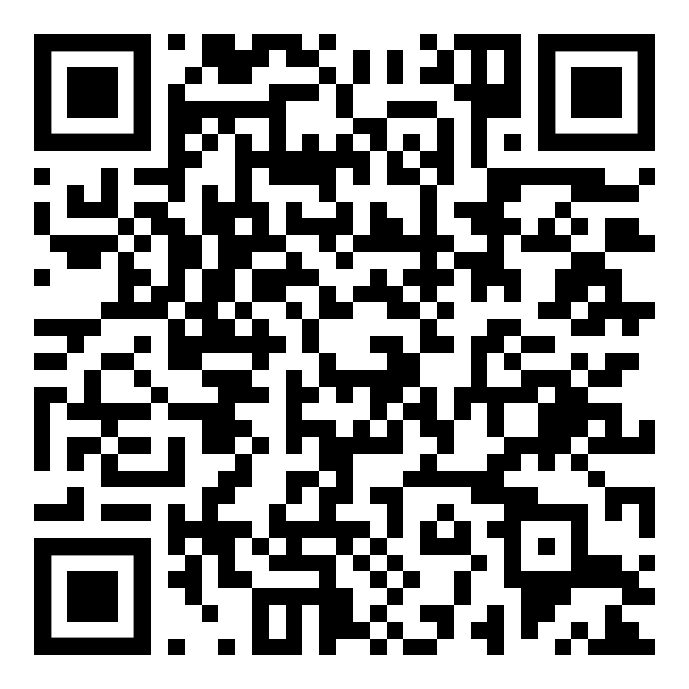
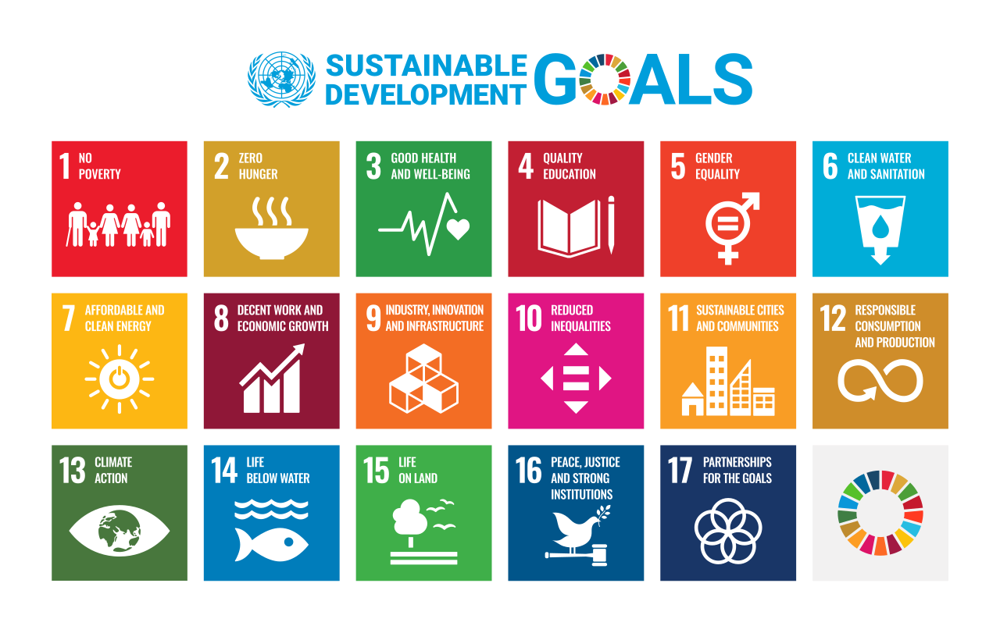

<p align="center">
	
	<br>
	<em>QR-Code scannen um dieses Dokument auf dem IPad zu öffnen</em>
</p>

1. <code>Korrekturen und Ergänzungen zu diesem Dokument sind erwünscht. Bitte fügen Sie diese in [Google Docs](https://docs.google.com/document/d/12Gqtnn5DdQmN6GDQs-ADqzZjTsvVcVF5w9dpGsSQXM4/edit?usp=sharing) ein. Ich werde versuchen, sie so schnell wie möglich zu integrieren.</code>

# Inhalt
- [Klimawandel](#klimawandel)
  - [Ursachen](#ursachen)
  - [Auswirkungen](#auswirkungen)
  - [Reaktion auf den Klimawandel](#reaktion-auf-den-klimawandel)
- [Globale Disparitäten](#globale-disparitäten)
  - [Fortschritte bei der Reduzierung globaler Disparitäten](#fortschritte-bei-der-reduzierung-globaler-disparitäten)
  - [Defizite bei der Minimierung globaler Disparitäten](#defizite-bei-der-minimierung-globaler-diskrepanzen)
- [Klassifizierung von Ländern](#klassifizierung-von-ländern)
- [Indizes](#indizes)

# Klimawandel

[Video](https://www.youtube.com/watch?v=tMwFNMfjFuU)

Der **Klimawandel** bezieht sich auf signifikante und langfristige Veränderungen im statistischen Verteilungsmuster von Wetterereignissen über Zeiträume, die von Jahrzehnten bis zu Millionen von Jahren reichen können. Es umfasst sowohl den globalen Erwärmungstrend aufgrund der Erhöhung von Treibhausgasen in der Atmosphäre als auch die damit verbundenen großräumigen Veränderungen in Wettermustern. Obwohl Klimaschwankungen natürliche Phänomene sind, zeigt der aktuelle Trend deutliche Zeichen einer beschleunigten Erwärmung, die vorrangig auf menschliche Aktivitäten zurückzuführen ist, insbesondere auf die Verbrennung fossiler Brennstoffe und großflächige Landnutzungsänderungen.

### Ursachen

Die Hauptursache des Klimawandels ist der anthropogene Treibhauseffekt. Dieser entstand durch die von Menschen verursachte Erhöhung der Konzentration von Treibhausgasen wie Kohlendioxid (CO₂), Methan (CH₄) und Distickstoffmonoxid (N₂O) in der Atmosphäre. Die konkreten Gründe für den Anstieg der Treibhausgaskonzentrationen sind:
- **Reduzierung der Kohlendioxidsenken**: Der Anteil der CO₂-Emissionen, der von Kohlenstoffsenken an Land oder im Meer aufgenommen wurde, ist in den letzten 50 Jahren zurückgegangen.
- **Landwirtschaft**: Methanemissionen aus Reisanbau und Viehzucht sowie N₂O aus gedüngten Feldern.
- **Industrielle Prozesse**: Die Produktion von Zement, Stahl und anderen Materialien setzt große Mengen an CO₂ frei.
- **Energieerzeugung**: Der hohe Anteil an kohle- und gasbasierten Kraftwerken in der globalen Energieerzeugung.
- **Transport** Große Mengen an Emissionen aus dem mit fossilen Brennstoffen betriebenen Verkehr.


### Auswirkungen

  - **Temperaturanstieg**: Seit 1981 ist die Durchschnittstemperatur in Deutschland um 1,4° gestiegen.
  - **Gletscherschmelze**: Gletscher in Alaska, im Himalaya und in den Alpen haben ihre Schmelzgeschwindigkeit in den letzten 30 Jahren vervierfacht. In der Alpenregion haben die Gletscher seit Beginn der industriellen Revolution mehr als die Hälfte ihrer Masse verloren.
  - **Meeresspiegelanstieg**: Aufgrund der thermischen Ausdehnung des Wassers und des Schmelzens der Gletscher, die durch den Klimawandel verursacht werden, ist der Meeresspiegel seit Beginn des 20. Jahrhunderts um 15 cm gestiegen; in den letzten 20 Jahren hat sich die Rate des Meeresspiegelanstiegs um das 2,5-fache erhöht und beträgt nun 3,6 mm pro Jahr.
  - **Zunehmende Wetterextreme**: Der Klimawandel erhöht die Frequenz von Extremwetterereignissen wie Hitzewellen, Starkregen und Stürmen.
  - **Ozeanversauerung**:  Die zunehmende Aufnahme von CO₂ durch die Ozeane führt zur Versauerung des Meerwassers, was marine Lebensformen und Ökosysteme beeinträchtigt (Z.b. Korallenbleiche).
  - **Veränderung der regionalen Temperatur- und Niederschlagsmuster**: In Karlsruhe haben sich die Sommertage (Tage mit Temperaturen über 25 °C) seit 1870 mehr als verdoppelt (von 30 auf 70 Tage). Gleichzeitig haben sich die Eistage (Tage mit Temperaturmaxima unter 0°C) von 20 auf 10 Tage halbiert.


#### Naturereignis / Naturgefahr 

Als **Naturereignis** werden natürliche Vorgänge wie Lawinenabgänge, Stürme, Erdbeben oder Überschwemmungen bezeichnet. Ist dieses Ereignis potenziell in der Lage, Menschen oder Sachgütern Schaden zuzufügen, spricht man von einer **Naturgefahr**.

### Reaktion auf den Klimawandel

Die Bekämpfung der globalen Herausforderung Klimawandel beinhaltet zwei Strategien: die Vermeidung der Ursachen (Mitigation) und damit den Klimaschutz und die Anpassung an die Folgen (Adaption). [Video](https://www.youtube.com/watch?v=2vqPfY7LjP8)


#### Vermeidung der Ursachen

- **Steigerung der Energieeffizienz**: Bessere Isolierung von Häusern, Nutzung von Wärmeenergie aus Kraftwerken zur Warmwasserbereitung.
- **Erneuerbare Energien**: Umstellung auf Wind-, Solar- und Wasserkraft reduziert fossile Brennstoffe.
- **Nachhaltige Forstwirtschaft**: Aufforstung und Schutz von Wäldern stärken natürliche CO₂-Senken.


#### Anpassung

- **Forstwirtschaft**: Waldumbau von Fichtenmonokulturen in standortgerechte Mischbestände zur Erhöhung der Widerstandsfähigkeit gegen hohe Temperaturen und Dürre.
- **Landwirtschaft**: Züchtung von hitzeresistenten Kulturen.
- **Küstenschutz**: Errichtung von Warften (Siedlungshügel) zum Schutz gegen steigende Wasserstände in Küstenregionen.
- **Küstenschutz 2**: Anpflanzung von Mangrovenwäldern in tropischen, vom steigenden Meeresspiegel bedrohten Regionen, zur Verringerung der Küstenerosion.
- **Tourismus**: Anpassung der Tourismusbranche, z. B. Umstieg von Skitourismus auf Badetourismus.


#### Kyoto-Protokoll

Im Kyoto-Protokoll von 1997 wurde erstmals die Reduktion von Treibhausgasen in einem völkerrechtlich bindenden Vertrag verankert. Die unterzeichnenden Industriestaaten verpflichteten sich, ihre Treibhausgas-Emissionen insgesamt um 5,2% gegenüber den Emissionen des Jahres 1990 zu reduzieren.  Das Pariser Protokoll löste das im jahr 2020 ausgelaufene Kyoto Protokoll ab. 

#### Klimakonferenz von Paris 2015

Am 12.12.2015 schlossen 196 Staaten einen Vertrag, um den Klimawandel zu bremsen und seine Auswirkungen zu reduzieren. Durch das Abkommen soll der globale Temperaturanstieg auf deutlich unter 2 °C im Vergleich zum vorindustriellen Niveau beschränkt werden. Jedes Land soll selbst festlegen, um wie viel Prozent es die Treibhausgasemissionen reduzieren möchte. [Video](https://www.youtube.com/watch?v=Sr2J_1J9w3A)


#### Methoden der Temperaturkontrolle in Städten

In städtischen Gebieten entsteht oft eine städtische Wärmeinsel. **Städtische Wärmeinsel** bezeichnet ein Phänomen, bei dem die Temperatur innerhalb einer Stadt höher ist als in direkt angrenzenden unbebauten Gebieten. Um diesen Effekt zu bekämpfen, gibt es folgende Methoden:
- **Begrünung von Dächern und Fassaden**: Pflanzen auf Dächern und an Fassaden können helfen, die Oberflächentemperatur von Gebäuden zu senken. Gründächer speichern Regenwasser.
- **Anlage von Parks und Grünflächen**: Die Schaffung von Parks und Grünflächen dient der Senkung der Umgebungstemperatur durch die Verdunstungskälte der Pflanzen und den Schatten der Bäume.
- **Verwendung heller Baumaterialien**: Durch die Verwendung heller Farben und reflektierender Materialien bei Straßen und Gebäuden kann die Menge der absorbierten Sonnenenergie reduziert und somit die Umgebungstemperatur gesenkt werden.
- **Wasserelemente in der Stadtplanung**: Brunnen, Teiche und andere Wasserelemente kühlen die umgebende Luft durch Verdunstung.


### Klima-Engineering

[Video](https://www.youtube.com/watch?v=eYYJZaTIMb0)


Klima-Engineering ist die absichtliche Veränderung der planetarischen Umwelt, um dem anthropogenen Klimawandel entgegenzuwirken. Klima-Engineering wurde bisher nicht auf planetarischer Ebene angewendet. Lokal wird Klima-Engineering beispielsweise in Form von Wolkenimpfung angewendet. Nachfolgend sind die Technologien aufgeführt, die für das globale Klima-Engineering vorgeschlagen werden:


#### Negative-Emissionen-Technologien

Negative-Emissionen-Technologien sind Ansätze zur Entnahme von Treibhausgasen aus der Atmosphäre: 

- Unterirdische Einlagerung von Holz.
- Gewinnung von Kohlenstoff aus der Umgebungsluft, Abscheidung und Lagerung (DACCS) mit folgender Speicherung des Kohlenstoffdioxids im Untergrund und auf dem Grund der Ozeane.
- Aufforstung und Wiederaufforstung.
- Ozeandüngung z. B. mittels Eisen, um auf diese Weise das Algenwachstum zu verstärken und mehr CO₂ aus der Atmosphäre zu binden.


#### Solar Radiation Modification

Solar Radiation Modification ist eine Form des Klima-Geoengineerings, das darauf abzielt, die Menge des in den Weltraum zurückreflektierten Sonnenlichts zu erhöhen.

- **Mirrors in Space (MIS)**: Satelliten, die die Menge der Sonnenstrahlung verringern sollen, die auf die Erde einwirkt.
- **Stratosphären-Aerosol-Injektion (SAI)**: Eine vorgeschlagene Methode, Aerosole in die Stratosphäre einzubringen, um durch globale Verdunkelung und erhöhte Albedo eine kühlende Wirkung zu erzielen, wie sie natürlich bei Vulkanausbrüchen auftritt. [Video](https://www.youtube.com/watch?v=dSu5sXmsur4)


#### Risiken

Großflächige Eingriffe bergen ein höheres Risiko unbeabsichtigter Störungen natürlicher Systeme. Dies wirft die Frage auf, ob Klimainterventionen möglicherweise mehr oder weniger schädlich sind als die Klimaschäden, die sie kompensieren. Es besteht weiterer Forschungsbedarf. Nachfolgend finden Sie eine Liste möglicher negativer Folgen von Geoengineering:

- **Biodiversitätsverlust und ökosystemare Schäden**: Technologien wie Ozeandüngung oder stratosphärische Aerosolinjektion könnten zu unvorhersehbaren und möglicherweise irreversiblen Schäden an Biodiversität und Ökosystemfunktionen führen. Dies schließt Veränderungen in Nährstoffkreisläufen und Sauerstoffversorgung sowie potenzielle Schäden an der Ozonschicht mit ein.
- **Terminierungsschock**: Ein abruptes Beenden von Geoengineering-Praktiken wie der stratosphärischen Aerosolinjektion könnte zu einem schnellen Wiederanstieg der Temperaturen führen, was viele Arten nicht verkraften könnten, da sie sich nicht schnell genug an die veränderten Bedingungen anpassen können. Wenn einmal mit Klima-Engineering begonnen wurde, wird es sehr schwierig sein, damit aufzuhören.
- **Globale Ungleichheiten**: Es gibt erhebliche Bedenken hinsichtlich der internationalen Steuerung und der rechtlichen Rahmenbedingungen für Geoengineering, einschließlich der Risiken grenzüberschreitender Umweltauswirkungen und der Einhaltung internationaler Abkommen und Menschenrechte.

### $${\color{lightgreen}Neu:}$$ Kippschalter
In der Klimawissenschaft ist ein **Kippschalter** eine kritische Schwelle, deren Überschreiten zu großen, sich beschleunigenden und oft irreversiblen Veränderungen im Klimasystem führt[3]. Wenn Kipppunkte überschritten werden, haben sie wahrscheinlich schwerwiegende Auswirkungen auf die menschliche Gesellschaft und können die globale Erwärmung beschleunigen.


# Globale Disparitäten
 $${\color{darkorange}Wiederholung\ aus\ Kl1:}$$ **Disparitäten** bezeichnen signifikante strukturelle Unterschiede/Ungleichheiten. **Globale Disparitäten**: Ungleichheiten zwischen verschiedenen Ländern oder Weltregionen. [Video](https://www.youtube.com/watch?v=YGe0-9PdqUo&t=13s)

## Fortschritte bei der Reduzierung globaler Disparitäten
- **Armutsreduzierung**: Die globale Armutsrate ist seit 1990 erheblich gesunken. Laut Weltbank leben heute weniger Menschen in extremer Armut als jemals zuvor, bedingt durch verbesserte Wirtschaftspolitiken und den Zugang zu internationalen Märkten.
- **Bildungszugang**: Der Zugang zu Grundbildung hat sich weltweit verbessert, mit einem deutlichen Anstieg der Einschulungsraten. Initiativen wie die Globale Bildungspartnerschaft fördern Bildungsprogramme in über 60 Entwicklungsländern, was zu höheren Alphabetisierungsraten und besseren weiter Bildungschancen führt.
- **Gesundheitsversorgung**: Die globale Gesundheitsversorgung hat sich durch die Einführung von Programmen zur Bekämpfung von Infektionskrankheiten und durch die Verbesserung der medizinischen Infrastruktur verbessert. Die Mortalitätsraten von Kindern unter fünf Jahren sind weltweit zurückgegangen und der Zugang zu lebenswichtigen Impfstoffen hat sich erhöht.
- **Technologietransfer**: Die Verbreitung von Technologie, insbesondere der Zugang zum Internet und mobilen Netzwerken, hat sich in Entwicklungsregionen beschleunigt, was neue Möglichkeiten für Bildung und wirtschaftliche Entwicklung schafft.

## Defizite bei der Minimierung globaler Diskrepanzen

[Video](https://www.youtube.com/watch?v=1xJ6p0B5V_A)

- **Einkommensungleichheit**: Die Einkommensungleichheit sowohl innerhalb von Ländern als auch global hat in vielen Fällen zugenommen, was zu sozialer Unruhe und wirtschaftlicher Instabilität führt.
- **Klimawandel**: Der Klimawandel trifft ärmere Länder oft härter, obwohl sie am wenigsten zu dessen Ursachen beigetragen haben. Der Mangel an Ressourcen erschwert es diesen Ländern, sich an die Auswirkungen anzupassen und gleichzeitig ihre wirtschaftliche Entwicklung voranzutreiben. Derzeit erhöht die Menschheit jedes Jahr nur die Menge der Treibhausgasemissionen in die Atmosphäre.
- **Bildungschancen**: Trotz Verbesserungen im Bildungszugang gibt es weiterhin erhebliche Unterschiede in der Qualität der Bildung. Viele Kinder in Entwicklungsländern erhalten eine unzureichende Bildung.

# Klassifizierung von Ländern

### $${\color{darkorange}Wiederholung\ aus\ Kl1:}$$ Globaler Norden und Globaler Süden
Die Begriffe „Globaler Norden“ und „Globaler Süden“ bezeichnen keine rein geografischen Räume, sondern beschreiben Unterschiede in Wirtschaftskraft, Wohlstand und Entwicklungsindikatoren:
- Globaler Norden: Wirtschaftlich entwickelte, industrialisierte Länder, z. B. Nordamerika, Europa, Japan.
- Globaler Süden: Weniger entwickelte, oft ärmere Länder, z. B. in Afrika, Lateinamerika, Asien.

Diese Formulierung vermeidet die Wertung von „entwickelt“ vs. „unterentwickelt“, steht aber ebenfalls in der Kritik, weil auch der Globale Süden sehr unterschiedlich entwickelte Länder umfasst.

### $${\color{darkorange}Wiederholung\ aus\ Kl1:}$$ Industrieländer, Schwellenländer und Entwicklungsländer
[Video](https://www.youtube.com/watch?v=VOR4Sjhtu8w)
Die Einteilung in Industrie-, Schwellen- und Entwicklungsländer beruht auf unterschiedlichen sozioökonomischen Indikatoren:
- Industrieländer: Hochentwickelte Wirtschaft, hoher Lebensstandard, z. B. Deutschland, USA.
- Schwellenländer: Länder im Übergang vom Entwicklungs- zum Industrieland, mit wachsender Industrialisierung, z. B. Brasilien.
- Entwicklungsländer: Geringer Entwicklungsstand, niedriges Pro-Kopf-Einkommen, z. B. Afghanistan, Ghana

## Vergleich von Entwicklungsindikatoren nach Länderkategorie

Die folgende Tabelle hebt typische Wertebereiche für jeden Indikator in industrialisierten, aufstrebenden und Entwicklungsländern hervor.

<details>
  <summary>klicken für volle Tabelle</summary>

| **Indikator**                                         | **Industrieländer**                                                                                                                                         | **Schwellenländer**                                                                                                                                                                      | **Entwicklungsländer**                                                                                                                                                      |
|-------------------------------------------------------|------------------------------------------------------------------------------------------------------------------------------------------------------------------------------|----------------------------------------------------------------------------------------------------------------------------------------------------------------------------------------------------------------|------------------------------------------------------------------------------------------------------------------------------------------------------------------------------------------------------|
| **Gini-Koeffizient** (Ungleichheit)                   | Typischerweise geringe bis mäßige Ungleichheit – Gini ca. 0,25–0,40 in den meisten fortgeschrittenen Volkswirtschaften. (OECD nach Steuern ca. 0,24–0,49; z. B. nordische Länder ca. 0,25.)                      | Mäßige bis hohe Ungleichheit – Gini häufig im Bereich von 0,35–0,50, je nach Land. Viele aufstrebende Volkswirtschaften (z. B. in Lateinamerika) weisen Gini-Werte > 0,40 auf.                                             | Oft hohe Ungleichheit – Gini meist > 0,40, teils ca. 0,50–0,60+. Einige Entwicklungsländer haben zu den weltweit höchsten Gini-Werten gezählt (z. B. Südafrika ca. 0,63 vor Umverteilung).         |
| **BIP pro Kopf (USD)**                              | Hohe Einkommensniveaus – typischerweise zehntausende USD pro Person. Hoch einkommensstarke Nationen haben ein BNE pro Kopf von > ca. 14.000 USD (viele über 30.000 USD).                                 | Mittleres Einkommen – einige tausend bis niedrige zehntausende USD pro Kopf. Obere Mittelschichtsländer liegen etwa bei 4.500–14.000 USD pro Kopf, während untere Mittelschichtsländer ca. 1.100–4.500 USD aufweisen.  | Niedrigeinkommen – sehr geringes BIP pro Kopf (oft < 1.000–2.000 USD). Länder mit niedrigem Einkommen (WB-Definition) haben ein BNE pro Kopf von < 1.145 USD, was weitverbreitete Armut widerspiegelt. |
| **Human Development Index (HDI)**                   | **Hohe menschliche Entwicklung** – HDI im Bereich von ca. 0,80–0,94. Die meisten industrialisierten Länder fallen in die Kategorie „Sehr hoch“ (≥ 0,800).                                               | **Mäßig bis hohe HDI** – ungefähr 0,60–0,79. Viele aufstrebende Volkswirtschaften liegen in den Bereichen Hoch (0,700–0,799) oder im oberen Mittelfeld (0,550–0,699).                                                    | **Niedrig bis mäßige HDI** – oft < 0,55 (Kategorie „Niedrig“). Am wenigsten entwickelte Nationen haben häufig HDI-Werte im Bereich 0,40–0,50, was Defizite in Gesundheit, Bildung und Einkommen signalisiert.  |
| **Beschäftigte nach Wirtschaftssektor**<br>(Landwirtschaft / Industrie / Dienstleistungen) | Vorwiegend Dienstleistungen; minimale Landwirtschaft. In fortgeschrittenen Volkswirtschaften beschäftigt die Landwirtschaft nur wenige Prozent der Arbeitskräfte (oft < 5 %), Industrie ca. 20–30 % und Dienstleistungen typischerweise ca. 65–80 % (hohe Produktivität erlaubt einen geringen Anteil an landwirtschaftlicher Beschäftigung). | Gemischt, im Übergang befindliche Struktur. Die Landwirtschaft bleibt signifikant (etwa 10–30 % der Arbeitsplätze, wenn auch rückläufig mit der Entwicklung), Industrie ca. 20–35 % und Dienstleistungen rund 50–70 %. In Ländern mit unterem Mittelschichtseinkommen beträgt der Durchschnitt der Landwirtschaft ca. 35 % und Dienstleistungen ca. 47 % (in Ländern mit oberem Mittelschichtseinkommen höher). | Agrarische Mehrheit. Die Landwirtschaft dominiert die Beschäftigung und bindet oft über die Hälfte der Arbeitskräfte (Durchschnitt in Niedrigeinkommensländern ≈ 63 %, in einigen Fällen > 70 %). Industrie ist gering (~10–20 %) und Dienstleistungen sind aufgrund des frühen Entwicklungsstadiums begrenzt (20–40 % der Arbeitsplätze). |
| **Lebenserwartung bei der Geburt**                          | **Hohe Langlebigkeit:** typischerweise zwischen Mitte 70 und Mitte 80 Jahren. In Hoch-Einkommensländern liegt der Durchschnitt bei ca. 80 Jahren, viele überschreiten 80 (z. B. Japan ca. 84).                                 | **Mäßige Langlebigkeit:** etwa 65–75 Jahre. In Mittlereinkommensländern liegt der Durchschnitt bei ca. 71 Jahren, wobei Länder der oberen Mittelschicht sich den Werten der Hoch-Einkommensländer annähern können, während Länder der unteren Mittelschicht oft in den 60ern verharren.     | **Niedrigere Langlebigkeit:** oft zwischen Mitte 50 und Mitte 60 Jahren. In Niedrigeinkommensländern liegt der Durchschnitt bei ca. 63 Jahren, und einige konfliktbetroffene oder besonders arme Nationen haben Lebenserwartungen in den 50ern.          |
| **Globaler Hungerindex (GHI)**^1                      | **Niedrig (minimaler Hunger)** – GHI im „niedrigen“ Bereich (Wert < 10). Die meisten industrialisierten Länder werden im GHI nicht gelistet (vernachlässigbarer Hunger), effektiv < 5 (beste Kategorie). | **Niedriger bis mäßiger Hunger** – viele aufstrebende Länder verzeichnen niedrige Hungerwerte (z. B. Lateinamerika, Ostasien mit GHI < 10), während einige einen mäßigen Hunger (GHI ca. 10–19) aufweisen.                | **Erheblicher Hunger in vielen Fällen** – der GHI liegt häufig in der Kategorie „Ernst“ (20–34) und in schlimmsten Fällen in „Alarmierend“ (> 35). Regionen wie Subsahara-Afrika und Südasien zeigen oft GHI-Werte von ca. 35–45 (alarmierend). |
| **Globaler Gender Gap Index (WEF)**                     | **Geringe Geschlechterkluft:** typischerweise ca. 0,75–0,85 (75–85 % Gleichstellung). Viele entwickelte Länder rangieren an der Spitze, da sie > 80 % der Geschlechterunterschiede schließen (z. B. nordische Länder ca. 0,82–0,91; Island ca. 91 %). | **Mäßige Kluft:** oft ca. 0,65–0,75 (65–75 % Gleichstellung). Aufstrebende Volkswirtschaften variieren stark – einige (z. B. in Osteuropa oder Lateinamerika) liegen bei etwa 0,70–0,78, andere näher bei 0,60. Der globale Durchschnitt liegt bei ca. 0,684 (68,4 %), was viele aufstrebende Länder im mittleren Bereich widerspiegelt. | **Größere Geschlechterkluft:** Viele Entwicklungsländer erzielen Werte von ca. 0,50–0,65, was auf erhebliche Ungleichheiten hinweist. Die am niedrigsten bewerteten Länder erreichen ca. 0,40–0,55 (z. B. Afghanistan ca. 0,405 am unteren Ende). Insgesamt weisen Frauen in Niedrigeinkommensgesellschaften deutlich geringere Teilhabe in Bildung, Gesundheit sowie wirtschaftlicher und politischer Sphäre auf. |
| **Analphabetismusrate (Erwachsene)**                           | **Sehr geringer Analphabetismus** – praktisch universelle Alphabetisierung. Entwickelte Nationen haben Alphabetisierungsraten von ca. 96–99 %, sodass der Analphabetismus unter 5 % liegt (oft nur in kleinen älteren oder marginalisierten Gruppen). | **Mäßiger Analphabetismus** – verbessert, aber es bestehen weiterhin deutliche Lücken. Viele aufstrebende Länder weisen Alphabetisierungsraten im Bereich von 75–95 % auf, was einem Analphabetismus von ca. 5–25 % entspricht. (Beispielsweise Indien ca. 77 % alphabetisiert; China ca. 97 % alphabetisiert.) | **Hoher Analphabetismus** – ein signifikanter Anteil der Erwachsenen kann nicht lesen. Am wenigsten entwickelte Länder erreichen im Durchschnitt nur ca. 65 % Alphabetisierungsrate (≈ 35 % Analphabetismus). In einigen verarmten Ländern |

</details>

Kurzfassung der Tabelle ohne Erläuterungen:

| **Indikator**                  | **Industrieländer**     | **Schwellenländer**       | **Entwicklungsländer**   |
|--------------------------------|---------------------------|------------------------|--------------------------|
| Gini-Koeffizient               | 0,25 – 0,40               | 0,35 – 0,50            | 0,40 – 0,60              |
| BIP pro Kopf (USD)             | 20.000 – 60.000+          | 1.100 – 20.000         | 500 – 2.000           |
| HDI                            | 0,80 – 0,94               | 0,60 – 0,79            | 0,40 – 0,55              |
| Beschäftigung (Landw./Ind./Dien.) | <5% / 20–30% / 65–80%      | 10–30% / 20–35% / 50–70% | 50–70% / 10–20% / 20–40%   |
| Lebenserwartung (Jahre)        | 75 – 85                  | 65 – 75                | 55 – 65                  |
| Globaler Hungerindex           | 0 – 5                   | 0 – 19                 | 20 – 45                  |
| Gender Gap Index               | 0,75 – 0,91              | 0,65 – 0,75            | 0,40 – 0,65              |
| Analphabetismusrate (%)        | 0 – 5                   | 5 – 25                 | 25 – 40                  |


# Indizes

### Gini-Koeffizien
Der **Gini-Koeffizient** ist ein statistisches Maß zur Darstellung der Einkommens- oder Vermögensverteilung innerhalb einer Gesellschaft. Ein Gini-Koeffizient von 0 drückt perfekte Gleichheit aus, wo jeder den gleichen Anteil besitzt, während ein Wert von 1 maximale Ungleichheit repräsentiert, bei der eine Person alles besitzt und der Rest nichts. Er wird häufig verwendet, um soziale Ungleichheit zu quantifizieren.[Video: humanitäre Aspekte](https://www.youtube.com/watch?v=rEnf_CFoyv0), [Video: technische Aspekte](https://www.youtube.com/watch?v=y8y-gaNbe4U)

### $${\color{darkorange}Wiederholung\ aus\ Kl1:}$$ Bruttoinlandsprodukt BIP (Gross Domestic Product, GDP) 
Das **Bruttoinlandsprodukt** (BIP) ist der Wert aller Endprodukte und Dienstleistungen, die innerhalb eines Landes in einem Jahr produziert werden. Ein Endprodukt ist ein Produkt der später nicht als Teil von einem anderen Produkt verkauft wird. [Video](https://www.youtube.com/watch?v=Wy4TGV-tPd8)
<br><br> 

### $${\color{darkorange}Wiederholung\ aus\ Kl1:}$$ Bruttonationaleinkommen BNE (Gross National Income, GNI)
Das **Bruttonationaleinkommen** (BNE) ist eine wirtschaftliche Kennzahl, die die Gesamtwerte aller von Inländern eines Staates erwirtschafteten Einkommen über ein Jahr hinweg misst, unabhängig davon, ob diese im Inland oder Ausland erzielt wurden. [Video](https://studyflix.de/wirtschaft/bruttonationaleinkommen-bne-1422/video)
<br><br>

### $${\color{darkorange}Wiederholung\ aus\ Kl1:}$$ Human Development Index (HDI)
Der **Human Development Index** (HDI) ist ein zusammengesetzter Indikator, der drei Kernbereiche menschlicher Entwicklung abbildet:
  - Lebenserwartung bei Geburt
  - Bildung: gemessen anhand durchschnittlicher und erwarteter Schuljahre
  - Bruttonationaleinkommen pro Kopf in USD.

Die Indizes dieser Bereiche werden gemittelt und auf einer Skala von 0 (niedrigstes Entwicklungsniveau) bis 1 (höchstes Entwicklungsniveau) abgebildet. Der HDI wird jährlich im Human Development Report des United Nations Development Programme (UNDP) veröffentlicht. Deutschland hat HDI von 0,94 (2024). 1-0.8 hocher,0.8-0.5 mittlerer, 0.5-0 niedriger hdi. [Video](https://www.youtube.com/watch?v=UIARB24wAnw)
<br><br>

### $${\color{darkorange}Wiederholung\ aus\ Kl1:}$$ Human Sustainable Development Index (HSDI)
**Human Sustainable Development Index** (HSDI): ist HDI aber mit noch einem Kernbereich: den Treibhausgas-Emissionen pro Kopf (in CO2-Äquivalenten). ```(ein unglaublich wichtiger globaler Indikator, für den es nicht einmal eine englische Wikipedia-Seite gibt)```
<br><br>

### $${\color{darkorange}Wiederholung\ aus\ Kl1:}$$  Global Hunger Index (GHI)
Der **Global Hunger Index** (GHI) zielt darauf ab, das Ausmaß des Hungers auf regionaler, nationaler und weltweite Ebene zu messen. Der GHI kombiniert vier Komponentenindikatoren zur Bewertung des Hungers:
- Unterernährung der gesamten Bevölkerung. Dies macht ein Drittel des Index aus (1/3).
- Kindersterblichkeit (unter 5 Jahren). (1/3)
- Unterernährung bei Kindern. (1/6)
- Wachstumsverzögerung bei Kindern. (1/6)
<br><br>

### $${\color{darkorange}Wiederholung\ aus\ Kl1:}$$ Global Gender Gap Index (GGI)
Der **Global Gender Gap Index** (GGI), entwickelt vom World Economic Forum (WEF), quantifiziert Geschlechterdisparitäten in den Bereichen Gesundheit, Bildung, Wirtschaftsbeteiligung und politische Ermächtigung.
<br><br>

### $${\color{darkorange}Wiederholung\ aus\ Kl1:}$$ Analphabetenrate
Die Analphabetenrate, misst den Prozentsatz der erwachsenen Bevölkerung (typischerweise Personen ab 15 Jahren), der nicht in der Lage ist, einfache und kurze Sätze zu lesen und zu schreiben.
<br><br>

### $${\color{darkorange}Wiederholung\ aus\ Kl1:}$$ Lebenserwartung
Lebenserwartung gibt an, wie viele Lebensjahre eine Person aufgrund aktueller Sterblichkeitsraten durchschnittlich erwarten kann. Dieser Wert wird am häufigsten als Lebenserwartung bei Geburt angegeben.

### $${\color{darkorange}Wiederholung\ aus\ Kl1:}$$ Sustainable Development Goals (SDGs)
[Video](https://youtu.be/qAIolKgDPrA?si=TrnS3VuQC7vSU17w&t=31)

Die Ziele für nachhaltige Entwicklung (Sustainable Development Goals, SDGs) sind ein Bündel von 17 eng miteinander verknüpften Zielen, die 2015 von den Vereinten Nationen im Rahmen der Agenda 2030 verabschiedet wurden. Sie gehen über reines Wirtschafts- und Umweltdenken hinaus und umfassen unter anderem Gesundheitsversorgung, Bildung, Geschlechtergerechtigkeit, Friedensförderung und globale Partnerschaften. Mit dem Leitprinzip „Leaving No One Behind“ verpflichten sich die Staatengemeinschaft sowie alle gesellschaftlichen Akteure – Regierungen, Privatwirtschaft und Zivilgesellschaft – dazu, alle Menschen einzubeziehen und benachteiligte Gruppen besonders zu fördern. Die 169 Unterziele und 232 Indikatoren dienen einer transparenten Messung des Fortschritts, der jährlich im High-level Political Forum (HLPF) überprüft wird. Die SDGs gelten für alle Länder gleichermaßen das heißt, sie richten sich an jedes Land, ungeachtet dessen Entwicklungsstand.

<p align="center">
	
</p>

