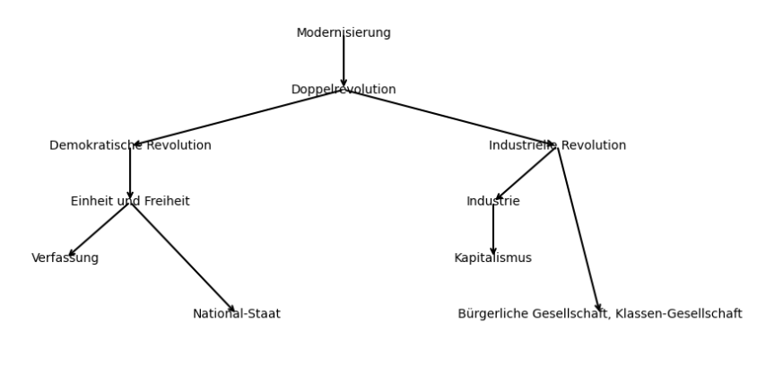
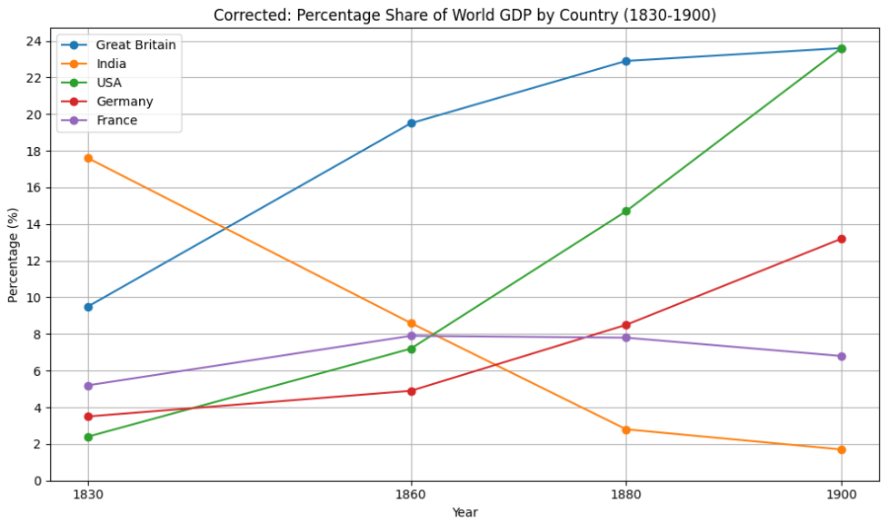

# Inhalt
- [Revolutionen: USA und Frankreich](#revolutionen-usa-und-frankreich)
- [Der Prozess der Modernisierung](#der-prozess-der-modernisierung)
- [Industrialisierung: England vs Deutschland](#industrialisierung-england-vs-deutschland)
- [Vor der Märzrevolution](#vor-der-märzrevolution)
- [Bürgertum](#bürgertum)
- [Quellenanalyse](#quellenanalyse)

# Revolutionen: USA und Frankreich
### USA
- England gewinnt den Siebenjährigen Krieg gegen Frankreich und erlangt die meisten französischen Kolonien in Nordamerika.
- England führt Erhöhungen von Steuern und Importbegrenzungen (z. B. Tee) für Kolonisten ein.
- Die Kolonisten hatten keine Vertretung im britischen Parlament. Sie begannen mit dem Widerstand gegen England unter dem Motto: „No taxation without representation“.
- Unabhängigkeitserklärung der USA: 1776
- Beeinflusst von der europäischen Aufklärung wandten sich die Verfasser der Erklärung vom Gottesgnadentum und der englischen Staatskirche ab und unterstützten die Menschenrechte.
### Frankreich
- Erhöhung der Steuern und Frustration von den Monarchen führte zur Unruhe in der Bevölkerung. Deswegen, als Ludwig XIV. die Generalstände einberief, erklärten die Vertreter des dritten Standes ihre eigene Nationalversammlung (1789), das löste Aufstände in Paris und ganz Frankreich aus, in deren Folge die „alte Ordnung“ gestürzt wurde.
- Inspiriert von der Aufklärung und der amerikanischen Revolution beschloss die Nationalversammlung die Erklärung der Menschen- und Bürgerrechte.
- In 1791 wurde die neue Verfassung erstellt, die Frankreich zu einer konstitutionellen Monarchie machte.
- Die Französische Revolution führte zur Etablierung der wirtschaftsliberalen Prinzipien wie Freizügigkeit, Berufs-, Gewerbe- und Vergünstigungen, Gleichheit vor dem Gesetz sowie Trennung von Kirche und Staat.
### Folgen
- Diese Revolutionen etablierten Grundsätze wie Grundrechte und Rechtsstaatlichkeit als Normen in Europa.
- Sie zwangen die Monarchen zu defensiver Modernisierung, um ihre Macht zu sichern.

# Der Prozess der Modernisierung

### Modernisierung
- Kern der Modernisierung: die Doppelrevolution aus politischer und industrieller Revolution.
- **Politische Modernisierung** (wegen der Revolutionen in USA und Frankreich):
	- Universelle Menschen- und Bürgerrechte.
	- Politische Mitbestimmung.
	- Liberale Demokratie.
	- Auflösung der Ständegesellschaft.
	- Abschaffung der Privilegien für Adel und Klerus.
- **Wirtschaftliche Modernisierung:**
	- **Industrialisierung:** Übergang von einer agrarischen Wirtschaft (Agraradelsgesellschaft) zu einer diversifizierteren Wirtschaftsstruktur (industrielle Gesellschaft) basierend auf: Massenproduktion, Automatisierung, Steigerung der Energieproduktion/-verbrauch, Wandel der Mehrheit der Arbeitskräfte vom primären Sektor (Landwirtschaft) in den sekundären (Industrie und Handwerk) und tertiären (Dienstleistungen) Sektor.
	- Technologische Innovationen: Dampfmaschine, Elektrotechnik, Kommunikationstechnik.
	- Weltwirtschaft: globale Wirtschaftsintegration.
- **Gesellschaftliche Modernisierung:**
	- Ideal der Chancengleichheit.
	- Bildung und Besitz bestimmen die soziale Stellung.
	- Individualisierung.
### Phasen der Industrialisierung
- **Frühindustrialisierung:**
	- Markiert den Übergang von manueller zu maschineller Produktion.
	- Entwicklung der Schrittmacherindustrien (England: Textilindustrie).
	- Erfindungen: Spinning Jenny, die Waterframe, mechanischer Webstuhl, Dampfmaschine.
- **Take-off-Phase:** Ausbreitung auf andere Industrien.
- **Hochindustrialisierung:**
	- Elektrotechnik, Entwicklung der chemischen Industrie.
	- Evolution der Kommunikation.
	- Multinationale Konzerne.
	- Aktiengesellschaften.

# Industrialisierung: England vs Deutschland

	
	 
	<em>Anteile verschiedener Länder an der Weltindustrieproduktion in %</em>

## England

### Englands Vorteile:
- Viele Kolonien als Rohstoffquellen und Absatzmärkte (Indien).
- Große und leicht zugängliche Ablagerungen von Kohle und Eisen.
- Geografische Lage: viele Häfen, reiche Zahl von Flüssen und Kanälen.
- Topografie: Industriegebiete lagen auf flachen Ebenen, was den Transport erleichterte.
- Erleichterter internationaler Handel und innerländischer Transport.
- Wirtschaftsliberalismus: wenige Regelungen für Unternehmen, niedrige Steuern.
### Englands Nachteile:
- Widerstand gegen technologische Veränderungen: Es gab sozialen Widerstand gegen die Mechanisierung.
- Kapitalmangel: In den frühen Phasen der Industrialisierung war es oft schwierig, genügend Kapital für große industrielle Projekte zu beschaffen.
### Ablauf:	
- 1733: Erfindung des Fliegenden Webers (Flying Shuttle) – beschleunigt den Webprozess.
- 1750er-1770er Jahre: Wachstum der Manufakturen in Textilien; Beginn der Verlagerung von Heim- zu Fabrikproduktion.
- 1790er Jahre: Expansion der Dampfkraft.
- 1800er Jahre: Aufkommen von Gasbeleuchtung in Fabriken, ermöglicht längere Arbeitszeiten.
- 1820er: George Stephenson entwickelt die erste öffentliche Eisenbahnlinie.
- 1851: Die erste Weltausstellung im Kristallpalast in London.
- 1860er: Einführung des limitierten Haftungsgesetzes, erleichtert die Gründung von Aktiengesellschaften.
- 1870er Jahre: Entwicklung des Gilchrist-Thomas-Verfahrens zur Stahlerzeugung, ermöglicht die Verwendung von phosphorhaltigen Erzen.
## Deutschland
### Deutschlands Vorteile:
- Ablagerungen von Kohle.
- Friedensperiode: Deutschland war zwischen 1815 und 1913 nur vier Jahre im Krieg
### Deutschlands Nachteile:
- Veile Zollgrenzen: Deutschland war kein einheitlicher Herrschafts- und Wirtschaftsraum.
- Bis 1871 kiene einheitliche Währung.
- Agrarrevolution pasierte später als in Großbritannien.
- Deutschland musste Kriegsentschädigungen zahlen.
- Deutschland war kein Kolonial Land.
### Ablauf:	
- 1785: Erste Dampfmaschine wird in der Textilproduktion bei Düsseldorf eingesetzt.
- 1835: Erste Bahnstrecke Deutschlands wurde  zwischen Nürnberg und Fürth.
- 1850er: Breites Eisenbahnsystem.
- Wegen Eisenbahn wird Eisen- und Stahlsektor zu Schrittmacherindustrie.
- 1850er: im Ruhrgebiet und in Oberschlesien entstahen Industriezentren.
- Zweite Hälfte des 19. Jahrhunderts: Hochindustrialisierung(Erfindungen in den Bereichen Elektrotechnik, Maschinenbau und Chemie)

# Vor der Märzrevolution

### Wiener Kongress 1815
- Ziele:
	- Balance der Mächte: Das Gleichgewicht zwischen den fünf Großmächten Großbritannien, Russland, Österreich, Preußen und Frankreich wiederhergestelltelen.
	- Restauration: Wiederherstellung der vor-napoleonischen Herrschaftsstrukturen in Europa.
- Folgen:
	- Restaurierte Monarchien: Wiederherstellung vieler Monarchien, die durch Napoleon abgesetzt worden waren.
	- Heilige Allianz: Bildung einer Koalition zwischen Russland, Österreich und Preußen zur Sicherung der restaurativen Ordnung.
### 1815-1848: Vormärz und Aufstieg des Bürgertums
- **Gesellschaft**: Wachsende Bedeutung des Bürgertums, das in Besitz- und Bildungsbürgertum unterteilt ist, beginnt die ständische Gesellschaft zu verdrängen.
- **Entstehung der Biedermeier-Kultur:** Rückzug ins Private, Kultur und häusliche Werte während der Restaurationszeit.
- **Politik**: Das Bürgertum bildet eine politische Öffentlichkeit in bürgerlichen Vereinen, die zunehmend nach Einfluss strebt.
- 1830: Julirevolution in Frankreich
- 1832: Hambacher Fest
	- **Ereignis**: Zusammenkunft von ca. 30.000 Menschen, die einen deutschen Nationalstaat und liberale Freiheiten fordern.
	- **Symbolik**: Zeigen der deutschen und polnischen Flagge als Ausdruck der Solidarität mit anderen nationalen Bewegungen.
- 1840er: Fortsetzung des Aufstiegs des Bürgertums und kulturelle Entwicklungen
	- **Kultur**: Das Bildungsbürgertum fördert aktiv Bildung, Wissenschaft und kulturelle Belange.
	- **Politik**: Steigende politische Aktivität und Unzufriedenheit mit politischer Stagnation und begrenzten Reformen.
- 1848: Revolution in Europa
	- **Februarrevolution in Frankreich**: Abdankung von Louis Philippe und Ausrufung der Zweiten Republik.
	- **Ausbreitung**: Revolutionäre Bewegungen greifen auf Deutschland, Italien und die Habsburgermonarchie über.
	- **Deutschland**: Einberufung von Nationalversammlungen in verschiedenen deutschen Staaten zur Beratung über nationale Einheit und liberale Verfassungen.

# Bürgertum
Das **Bürgertum** ist die gesellschaftliche Schicht der Bürger, die durch Besitz, Bildung und städtisches Leben gekennzeichnet ist und zwischen Adel und Arbeitern steht.
### Typen

- Besitzbürgertum:
	- Bürger mit überdurchschnittliche Menge von  materiellen Ressourcen.
 	- Bankiers, Großkaufleute, Kapitalbesitzer und Unternehmer
  	- Untergruppen:
  		- Großbürgertum(bürgerlichen Elite: Großindustrielle, Überseekaufleute,  Eisenbahnmagnaten)
  		- Wirtschaftsbürgertum(Unternehmern in Industrie, Handel und Handwerk)
  	- Ca. 3-4 % der Bevölkerung in Deutschland
- Bildungsbürgertum:
	- Bürger die höhere Bildung besaßen und sie beruflich verwendeten.
	- Pfarrer, Ärzte, Rechtsanwälte, Gymnasiallehrer und Professoren.
 	- Ca. 1 % der Bevölkerung in Deutschland
- Das Kleinbürgertum:
	- Unter untere soziale Schicht, arbeitnehmerähnliche Abhängigkeit und teils prekäre wirtschaftliche Lage.
	- Kleinen Selbstständigen, Handwerkern, Kleinhändlern, mittleren und kleinen Angestellten und Beamten.
 	- Ca. 10 % der Bevölkerung in Deutschland.
### Merkmale der bürgerlichen Kultur
- Werte und Normen: Betonung von Besitz, Bildung, Selbstständigkeit, Leistungsrespekt Fleiß, Selbstdisziplin und Sparsamkeit.
- Klare Rollenverteilung mit dem Mann als Ernährer und der Frau als Verantwortliche für Haushalt und Kindererziehung.
- Kulturelle Bildung: Förderung von Kunst und Kultur, z. B. durch Hausmusik, Theater- und Konzertbesuche.
- Soziale Regeln: Wert auf gepflegtes Aussehen, Sauberkeit, gutes Benehmen.
- Teilnahme an Vereinen und Lesegesellschaften zur Meinungsbildung und politischen Partizipation.
- Streben nach sozialer Anerkennung und Statussicherheit durch Bildung und moralisches Verhalten.
- Engagement in der liberalen Nationalbewegung, Spannungsfeld zwischen liberalen Idealen und Klasseninteressen.
- Differenzierung gegenüber Adel und Unterschichten, Unterstreichung des eigenen Führungsanspruchs.

# Quellenanalyse

### Einleitung
- Textsorte (z. B. Tagebucheintrag, Zeitungsartikel, politische Rede, etc.)
- Autor oder Autorin
- Titel 
- Datum und Ort der Veröffentlichung
- Thema 
- Adressat
- Absicht des Autors
- Quellenart
### Hauptteil
- Inhaltsangabe
- Analyse
	- Argumentationsstruktur des Textes
	- Argumentationsstil
	- Sprachliche Mittel
- Einordnung in den historischen Kontext
	- Ursachen und Folgen
	- Historische Daten und Zusammenhänge
### Schluss: Werturteil oder Sachurteil
#### Sachurteil
- Sind die Aussagen des Autors kritisch, übertrieben oder positiv?
- Wie relevant ist die Quelle zu ihrer Zeit gewesen?
- Welche Relevanz hat diese Quelle aus heutiger Sicht?
#### Werturteil
- persönliche Meinung
- Man muss sowohl die damalige gesellschaftliche Lage berücksichtigen als auch die eigene Meinung im Bezug auf die derzeitige Situation und Lebensführung.
