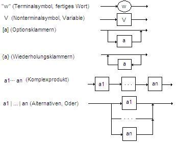

- Ein **Abstrakter Datentyp (ADT)** ist zunächst einmal ein Verbund von Objekten. Er verrät nichts über seinen inneren Aufbau, sondern erlaubt den Zugriff auf die enthaltenen Objekte ausschließlich mittels seiner Methoden. Diese Methoden sind über ihre Signatur definiert. Eine Klasse, die einen ADT darstellen soll, muss alle definierten Methoden6enthalten. Ein ADT definiert zusätzlich noch eine bestimmte Semantik, d.h. man erwartet, dass der Aufruf einer Methode einen bestimmten Effekt hat, der unabhängig von der darunterliegenden Implementation ist. Die Definition der Schnittstellen der ADTs mit ihrem erwarteten Verhalten ist im Dokument: https://lehrerfortbildung-bw.de/u_matnatech/informatik/gym/bp2016/fb2/04_datentypen/1_hintergrund/3_definitin/03_definition_adts.odt 

# FORMALE SPRACHEN UND AUTOMATEN

Ein Alphabet **Σ** ist eine endliche Menge von Symbolen. Ein Alphabet **Σ** wird in geschweiften Klammern angegeben, und jedes Symbol wird in doppelte Anführungszeichen gesetzt. Zum Beispiel: **Σ = {"a", "b", "xx"}**. Dabei ist "xx", ein einzelnes Symbol.

**Σ\*** (Sigma-Stern) besteht aus allen möglichen Kombinationen von Symbolen aus **Σ**, mit einer Länge von 0 oder größer. Jede dieser Symbolkombinationen wird **Wort** genannt. Auch das Wort der Länge 0 gehört dazu das **leere Wort**, bezeichnet mit **ε** (Epsilon). Bemerkung: Eine Menge, die das leere Wort enthält , ist **nicht** die leere Menge ( {ε} ≠ ∅ ). Noch eine unerwartete Eigenschaft ist das die Stern-Operation auf der leeren Menge ergibt eine Menge, die ein einziges Element enthält, nämlich das leere Wort:  **∅\*** = **{ε}**

Eine **formale Sprache** **L** ist eine **Teilmengen** von **Σ\***,  für die ein Satz von **formalen Regeln** existiert, der eindeutig bestimmen kann, ob ein Wort zu **L** gehört oder nicht. (Die Bedingung der Existenz solcher **formalen Regeln** wird in vielen Quellen oft weggelassen, muss jedoch bei uns vorhanden sein.) 

Eine formale Sprache kann durch eine Grammatik definiert werden. In unserem Fall verwenden wir Typ 2 Grammatik oder Kontextfreie Grammatik. Eine **kontextfreie Grammatik (KFG)** ist ein **Viertupel** (also eine geordnete Menge der Form): **G = (V, Σ, P, S)**
Dabei gilt:

- **V** ist die endliche Menge der **Nichtterminalsymbole** (auch gennant Variable).  
- **Σ** ist die endliche Menge der **Terminalsymbole** (das Alphabet).  
- **P** ist die Menge der **Produktionsregeln**.  
- **S ∈ V** ist das **Startsymbol**.

Bemerkungen zur Grammatik:

- Das **Startsymbol S** ist keine Menge aus Symbolen, sondern ein einzelnes Symbol aus der Menge der Nichtterminalsymbole V.  
- Die **Reihenfolge der Elemente** im Viertupel **G = (V, Σ, P, S)** ist wichtig.

Beispielgrammatik: 
```
G = (V, Σ, P, S) 
Σ = { 'U', 'S', '1', '2', '3' }
V = { <linie>, <U-Bahn>, <S-Bahn>, <2Ziffer>, <3Ziffer> }
S = <linie>
P = {
<linie>   → <U-Bahn>,             (R1)
<linie>   → <S-Bahn>,             (R2)
<U-Bahn>  → 'U' <2Ziffer>,        (R3)
<S-Bahn>  → 'S' <3Ziffer>,        (R4)
<2Ziffer> → '1',                  (R5)
<2Ziffer> → '2',                  (R6)
<3Ziffer> → <2Ziffer>,            (R7)
<3Ziffer> → '3',                  (R8)
}
```
Beispiel-Linksableitung für 'U2':

```
            (R1)              (R2)                   (R4)
 <linie>  ———————→ <U-Bahn> ———————→ 'U' <2Ziffer> ———————→ 'U' '2'           
```

Syntax ist ein Regelwerk, der bestimmt, ob ein Wort zu der Sprache gehört oder nicht. Syntaktische Fehler: Verletzen diese Regeln, sodass die Zeichenkette nicht wohlgeformt ist (z. B. fehlende Klammer).

Semantik: Ordnet wohlgeformten Ausdrücken eine Bedeutung zu, z. B. mittels einer Interpretations-/Bewertungsfunktion; in Programmiersprachen beschreibt sie, was ein syntaktisch gültiges Programm bewirkt. Semantische Fehler: Treten auf, wenn ein syntaktisch korrekter Ausdruck im gegebenen Modell eine ungültige Bedeutung at (z. B.  wenn gegebene Wort nicht interpretierbar ist). 

### Syntax-Diagramme  
Syntax-Diagramme sind grafische Darstellungen von Produktionsregeln einer Sprache. Für weitere Informationen sehe diese Seite: [inf-schule.de Fachkonzept - Syntaxdiagramm
](https://inf-schule.de/automaten-sprachen/sprachenundautomaten/sprachbeschreibung/syntaxdiagramme/konzept_syntaxdiagramm)

<!--
<p align="center"></p>
-->

### Chomsky-Hierarchie
Chomsky Hierarchie
Die Chomsky Hierarchie ordnet formale Grammatiken nach der Form ihrer Produktionsregeln in vier Klassen(Typ 0, Typ 1, Typ 2, Typ 3). Dabei gilt: Jede Grammatik im Sinne von beschrieben obenen Viertupel **G = (V, Σ, P, S)** ist Typ-0 Grammatik. Dabei ist Typ 1 eine Spezialisierung von Typ 0, Typ 2 eine Spezialisierung von Typ 1 und Typ 3 eine Spezialisierung von Typ 2.

- Typ 0: Rekursiv aufzählbare Grammatiken. Es gibt keine Einschränkung an die Produktionsregeln. Damit ist jede Grammatik automatisch auch eine Grammatik vom Typ 0.
- Typ 1: Kontextsensitive Grammatiken. Bei einer Ableitung darf ein Ausdruck nicht kürzer werden.
- Typ 2: Es gelten alle Einschränkungen wie für Typ 1 plus: Die linke Seite jeder Produktionsregel besteht genau aus einem einzelnen Nichtterminalsymbol.
- Typ 3: Es gelten alle Einschränkungen wie für Typ 2 plus: Die rechte Seite einer Produktionsregel besteht aus genau einem Terminalsymbol oder aus einem Terminalsymbol gefolgt von einem Nichtterminalsymbol.

Da Typ 1, Typ 2 und Typ 3 im Allgemeinen nicht verkürzend sind, können sie das leere Wort nicht direkt erzeugen.
Deshalb lässt man als Ausnahme die Regel S→ε zu. Dies ist nur erlaubt, wenn das Startsymbol S in keiner rechten Regelseite vorkommt.

### Deterministischer endlicher Automat (DEA)

DEAs sind Repräsentationen von Grammatiken, die für eine beliebige Eingabe eines Wortes entscheiden, ob diese der entsprechenden Grammatik folgt oder nicht. Man sagt dann: Der Automat akzeptiert bzw. erkennt das Wort oder eben nicht.

Ein DEA ist ein 5 Tupel **M = (Z, Σ, δ, z₀, E)**. Dabei gilt:

- **Z** Menge aller Zustände.
- **Σ** Eingabealphabet.
- **δ : Z × Σ → Z** Übergangsfunktion.
- **z₀ ∈ Z** Startzustand.
- **E ⊆ Z** Menge der Endzustände.

