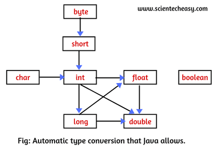

# Die objektorientierte Programmierung (OOP)
Video: [OOP Klassen und Objekte](https://www.youtube.com/watch?v=c6RrcEvIix0)

**Objektorientierte Programmierung (OOP)** ist ein Programmierparadigma, das auf dem Konzept von "Objekten" basiert, welche Daten in Form von Attributen sowie Verhalten in Form von Methoden enthalten. OOP modelliert Situationen als eine Sammlung von Objekten, die miteinander interagieren. OOP basiert auf vier Grundprinzipien: Kapselung, Abstraktion, Vererbung und Polymorphismus.

**Klasse** ist eine Vorlage, die Attribute und Methoden zur Erstellung spezifischer Instanzen von Objekten definiert.

**Objekt** ist eine Instanz einer Klasse, die spezifische Werte für die in der Klasse definierten Attribute enthält und Methoden gemäß dieser Definitionen aufweist.

### Prinzipien der OOP
Artikel: [4 Principles](https://khalilstemmler.com/articles/object-oriented/programming/4-principles/)
- **Vererbung** ist ein Mechanismus, bei dem eine neue Klasse (Unterklasse) die Eigenschaften und Verhaltensweisen einer vorhandenen Klasse (Oberklasse/Superklasse) übernimmt. Dies ermöglicht Code duplizierung zu vermeiden, indem Methoden und Attribute wiederverwendet werden, die in der Basisklasse definiert sind[^1]. [Video](https://youtu.be/gifpyGpD-fE?si=VKiJZwBEaFKjVaAg&t=352)
- **Kapselung** bezeichnet das Prinzip, durch welches der interne Zustand eines Objekts vor direktem Zugriff von außen geschützt wird. Dies wird erreicht, indem man Attribute eines Objekts als privat deklariert und den Zugriff auf diese Daten über öffentliche Methoden regelt[^2]. [Video](https://www.youtube.com/watch?v=bnPSLyxvaUY)
- **Polymorphismus** ist die Fähigkeit von Objekten verschiedener Klassen, auf dieselben Methodenaufrufe zu reagieren, wobei jedes Objekt gemäß seiner Klassenimplementierung unterschiedliche Verhaltensweisen zeigen kann. Dies ermöglicht es, Methoden zu definieren, die in der Basisklasse deklariert sind, jedoch in abgeleiteten Klassen unterschiedlich implementiert werden, wodurch die Funktionalität überschrieben wird[^3]. [Video](https://www.youtube.com/watch?v=jhDUxynEQRI)
- **Abstraktion** ist der Prozess, bei dem für den Nutzer relevanten Attribute und Verhaltensweisen eines Objekts hervorgehoben werden, wären die technische Implementierung verborgen bleibt.

[^1]: https://roberta-home.de/fileadmin/user_upload/WebBooks/JavaBand/RobertaBuchch7.html#x8-800007.2
[^2]: https://roberta-home.de/fileadmin/user_upload/WebBooks/JavaBand/RobertaBuchch7.html#x8-810007.3
[^3]: https://roberta-home.de/fileadmin/user_upload/WebBooks/JavaBand/RobertaBuchch7.html#x8-830007.4

### Vorteile von OOP [^4]
- **Modularität**: Die Kapselung in OOP fördert die Modularität, indem sie die Isolierung von Fehlerquellen erleichtert. Dies vereinfacht das Debugging, da sich Entwickler auf die fehlerhafte Klasse konzentrieren können.
- **Code-Wiederverwendung**: OOP ermöglicht die Wiederverwendung von Code durch Vererbung. Klassen können Merkmale und Methoden erben, was die Notwendigkeit reduziert, duplizierenden Code zu schreiben, was Zeit spart und Fehlerquellen reduziert.
- **Flexibilität**: Durch Polymorphismus bietet OOP die Flexibilität, Methoden anzupassen, die ihr Verhalten abhängig vom Kontext ändern können. Dies erleichtert die Entwicklung, indem der Code leichter an neue Anforderungen angepasst werden kann.
- **Abstraktion**: OOP ermöglicht es, große Projekte effektiv zu verwalten, indem Klassen als logische Repräsentationen von größeren Codeblöcken dienen.

### Nachrteile von OOP [^4]
- **Größere Programme**: Mit OOP geschriebene Programme sind tendenziell größer als solche, die prozedurale Programmierung verwenden. Dies kann zu einer langsameren Ausführung führen, da ihre Ausführung mehr Zeit in Anspruch nimmt.
- **Nicht für jedes Problem**: OOP ist nicht immer die beste Lösung. Es funktioniert am besten für Aufgaben, die durch Objekte ausgedrückt werden können, aber das Beispiel ist nicht geeignet für Einfache Skripte.

[^4]: https://www.xpheno.com/blogs/advantages-of-object-oriented-programming/

# Java OOP

#### Klassen
Eine Klasse in Java ist eine Vorlage für das Erstellen von Objekten, die Attribute und Methoden enthält.
```java
public class ClassName {
    // Attribute
    int attribute1;
    String attribute2;

    // Konstruktor
    public ClassName(int param1, String param2) {
        this.attribute1 = param1;
        this.attribute2 = param2;
    }

    // Methode
    public void method1() {
        // Code
    }
}
```

#### Vererbung (extends)
Vererbung ist ein Mechanismus, bei dem eine Klasse die Attribute und Methoden einer anderen Klasse erbt.
```java
public class SubClass extends SuperClass {
    // Zusätzliche Attribute oder Methoden
}
```

#### Abstrakte Klassen
Eine abstrakte Klasse kann nicht instanziiert werden und dient als Vorlage für andere Klassen.
```java
public abstract class AbstractClass {
    // Abstrakte Methode
    public abstract void abstractMethod();
}
```

#### Abstrakte Methoden
Abstrakte Methoden haben keinen Körper und müssen in den abgeleiteten Klassen implementiert werden.
```java
public abstract void abstractMethod();
```

#### Abrufmethoden (Getter)
Abrufmethoden sind dazu da, den Wert eines privaten Attributs zu lesen.
```java
public int getAttribute1() {
    return attribute1;
}
```

#### Änderungsmethoden (Setter)
Änderungsmethoden sind dazu da, den Wert eines privaten Attributs zu setzen oder zu ändern.
```java
public void setAttribute1(int attribute1) {
    this.attribute1 = attribute1;
}
```
#### Upcasting
**Upcasting** ist der Vorgang, bei dem ein Subklassenobjekt einer Superklasse zugeordnet wird.
Das ist immer sicher und wird automatisch von Java durchgeführt.
```java
class Tier {...}
class Hund extends Tier {...}

Tier tier = new Hund(); // Upcasting von Hund zu Tier
```

#### Downcasting
**Downcasting** bezieht sich auf das Umwandeln einer Superklassenreferenz zurück in eine Subklassenreferenz.
Downcasting muss explizit gemacht werden und kann zur Laufzeit zu `ClassCastException` führen, wenn nicht ordnungsgemäß gehandhabt.
```java
Tier tier = new Hund(); // Upcasting
Hund hund = (Hund) tier; // Downcasting
```

#### Methodenüberladung
**Methodenüberladung** tritt auf, wenn zwei oder mehr Methoden in derselben Klasse denselben Namen haben, aber unterschiedliche Parameterlisten aufweisen.
Überladene Methoden können unterschiedliche Rückgabetypen haben, solange die Parameterlisten unterschiedlich sind.
```java
class Display {
void show(int a) {
  System.out.println(a);
}
void show(String a) {
  System.out.println(a);
}
}
```

#### Methodenüberschreibung
**Methodenüberschreibung** findet statt, wenn eine Subklasse die Methode einer Superklasse, die sie erbt, neu definiert.
Die überschreibende Methode muss denselben Namen, Rückgabetyp und dieselben Parameter wie die Methode in der Superklasse haben. 
```java
class Tier {
  void essen() {
      System.out.println("Dieses Tier isst Essen.");
  }
}
class Hund extends Tier {

  void essen() {
      System.out.println("Der Hund frisst Fleisch.");
  }
}
```

### new
Das Schlüsselwort `new` wird verwendet, um ein neues Objekt einer Klasse zu erstellen. Es reserviert Speicher für das Objekt und ruft den Konstruktor der Klasse auf.

```java
MyClass object = new MyClass();  // Erstellt ein neues Objekt der Klasse MyClass
```

### this
Das Schlüsselwort `this` wird verwendet, um auf das aktuelle Objekt zu verweisen, das die Methode aufruft. [Video](https://www.youtube.com/watch?v=ETLHbHenW44)

Zugriff auf Attribute
```java
public class MyClass {
    private int x;
    
    public MyClass(int x) {
        this.x = x;  // Verweist auf das Attribut x der Klasse, nicht auf den Parameter
    }
}
```

Zugriff auf Methoden
```java
public void print() {
    this.display();  // Ruft die Methode display() desselben Objekts auf
}
```

Rückgabe des aktuellen Objekts
```java
public MyClass returnSelf() {
    return this;  // Gibt die aktuelle Instanz der Klasse zurück
}
```

### super
Das Schlüsselwort `super` wird verwendet, um Methoden oder Konstruktoren der übergeordneten Klasse aufzurufen. [Video](https://www.youtube.com/watch?v=Qb_NUn0TSAU)

Zugriff auf Konstruktor der Elternklasse
```java
public class ChildClass extends ParentClass {
    public ChildClass() {
        super();  // Ruft den Konstruktor der Elternklasse auf
    }
}
```

Zugriff auf überschriebene Methoden der Elternklasse
```java
public void display() {
    super.display();  // Ruft die Methode display() der Elternklasse auf
}
```

## Zugriffsmodifikatoren [^6]

| Modifikator  | Klassenintern | Paketintern | Subklassen | Weltweit |
|--------------|---------------|-------------|------------|----------|
| **public**   | Ja            | Ja          | Ja         | Ja       |
| **protected**| Ja            | Ja          | Ja  | Nein  |
| *(kein Modifikator)* | Ja   | Ja          | Nein       | Nein     |
| **private**  | Ja            | Nein        | Nein       | Nein     |

*_(alle Klassen ohne explizit angegebenes Paket gehören zum Standardpaket)_

#### Beschreibung

- **public**: Das Element ist von überall her zugänglich.
- **protected**: Das Element ist innerhalb derselben Klasse, im selben Paket und in abgeleiteten Klassen zugänglich.
- **(kein Modifikator)**: Auch bekannt als "package-private", das Element ist nur innerhalb des eigenen Pakets zugänglich.
- **private**: Das Element ist nur innerhalb der Klasse zugänglich, in der es deklariert wurde.
```java
class Person {
  public String fname = "John";
  protected String lname = "John Doe";
  String email = "john@doe.com";
  private int id = 80085;
}
```
[^6]: https://docs.oracle.com/javase/tutorial/java/javaOO/accesscontrol.html

# Java Spickzettel
### Primitive Datentypen [^5]
Primitive Datentypen werden direkt in Variablen gespeichert. [Video](https://www.youtube.com/watch?v=WQ7mvQFSmYc)

| Type    | Values              | Default | Size                | Range                                     |
|---------|---------------------|---------|---------------------|-------------------------------------------|
| byte    | signed integers     | 0       | 8 bits              | -128 to 127                               |
| short   | signed integers     | 0       | 16 bits             | -32.768 to 32.767                           |
| int     | signed integers     | 0       | 32 bits             | -2.147.483.648 to 2.147.483.647                 |
| long    | signed integers     | 0       | 64 bits             | -9223372036854775808 to 9223372036854775807|
| float   | IEEE 754 floating point | 0.0   | 32 bits             | +/-1.4E-45 to +/-3.4028235E+38, +/-infinity, +/-0, NaN |
| double  | IEEE 754 floating point | 0.0   | 64 bits             | +/-4.9E-324 to +/-1.7976931348623157E+308, +/-infinity, +/-0, NaN |
| char    | Unicode character   | \u0000  | 16 bits             | \u0000 to \uFFFF                         |
| boolean | true, false         | false   | 1 bit used in 32 bit integer | NA                                |

[^5]: https://latestjavatutorials.blogspot.com/2013/05/java-data-types.html
### Implizites vs Explizites Casting
Implizites Casting in Java erfolgt automatisch, wenn der Compiler „niedrigeren“ Typ in den „höheren“ Typ transformiert, während explizites Casting manuell durchgeführt werden muss.

### Implizites Casting [^7]
Bei der Durchführung von mathematischen oder Zuweisungsoperationen mit Operanden unterschiedlicher Typen in Java findet eine implizite Konvertierung statt, dabei könnte ein Teil von der Informationen aus der Variable ausgeworfen werden zum Beispiel wie bei Konversion von `long` auf `float`. Die folgende Abbildung veranschaulicht alle impliziten Castings, die Java ausführt:
<p align="center"></p>

#### Implizites Casting Beispiel
```java
int intVal = 42;
double doubleVal = intVal;
```
### Explizites Casting [^7]
Konvertierung eines höheren Datentyps in einen niedrigeren Datentyp wird als einschränkende Konvertierung bezeichnet. Da diese Art der Konvertierung vom Programmierer und nicht automatisch vom Compiler durchgeführt wird, wird sie in Java auch als explizite Typumwandlung bezeichnet. Bei expliziten Carsten könnte ein Teil von in der Variable gespeicherten Informationen verloren gehen (z.B abschneidung von Nachkommastellen).

#### Explizites Casting Beispiel 
```java
double d = 100.9;
long l = (long) d; // Explicit type casting.
```

[^7]: https://www.scientecheasy.com/2020/07/type-conversion-casting-java.html/

## Array
In Java, `Array` ist eine statische Struktur fester Größe, die homogene Datentypen enthält.

#### Deklaration
```java
int[] einArray = new int[10];
String[] stringArray = new String[5];
```

#### Deklaration und Initialisierung
```java
int[] zahlen = {1, 2, 3, 4, 5};
String[] worte = {"Hallo", "Welt"}; 
```

#### Zugriff auf Elemente
```java
int ersteZahl = zahlen[0];
zahlen[1] = 20;
```

#### Länge des Arrays
```java
int laenge = zahlen.length;
```

#### Durchlaufen mit einer Schleife
```java
for(String name : namen) {
    System.out.println(name);
}
```

## ArrayList
`ArrayList`, ist eine dynamische Struktur, die Objekte verschiedener Typen speichern kann und deren Größe automatisch anpasst, wenn Elemente hinzugefügt oder entfernt werden. Video: [Array vs ArrayList](https://www.youtube.com/watch?v=NbYgm0r7u6o)

#### Import
```java
import java.util.ArrayList;
```

#### Deklaration und Initialisierung
```java
ArrayList<String> namen = new ArrayList<>();
ArrayList<Integer> num = new ArrayList<>();
```
Achtung ` ArrayList<int> num = ... ` ist falsch !!!

#### Elemente hinzufügen
```java
namen.add("Anna");
namen.add("Bernd");
```

#### Zugriff auf Elemente
```java
String erstesElement = namen.get(0); 
```

#### Elemente entfernen
```java
// Entfernt "Bernd" aus der Liste
namen.remove(String.valueOf("Bernd"));

// Entfernt das Element an Index 0
namen.remove(0);
```

#### Größe der ArrayList
```java
int groesse = namen.size();
```

## 2D-Listen (2D Arrays)

#### Deklaration
```java
// Eine 2x3 Matrix (zwei Zeilen drei Spalten)
int[][] matrix = new int[2][3];
```

#### Deklaration und Initialisierung
```java
int[][] positionen = {
    {0, 0, 3},
    {1, 1, 2},
};
```

#### Zugriff auf Elemente
```java
// Zugriff auf das Element in Zeile 0, Spalte 1
int element = positionen[0][1]; 

// Setzen des Elements in Zeile 1, Spalte 1 auf 5
positionen[1][1] = 5; 
```
# Java Kommentare
#### Einzeilige Kommentare

```java
// Dies ist ein einzeiliger Kommentar
int number = 5;
```

#### Mehrzeilige Kommentare
```java
/* Dies ist ein
   mehrzeiliger Kommentar */
int number = 5;
```
### Javadoc
Javadocs sind eine spezielle Form von Kommentaren, die verwendet werden, um eine offizielle Dokumentation in HTML-Format zu generieren. Hier sind einige häufig verwendete Tags in Javadocs:
Javadoc-Kommentare beginnen mit `/**` und enden mit `*/`, jede Javadocs Kommentar Zeile soll ein Stern am Anfang haben.

#### @param
`@param` wird verwendet, um einen Parameter zu beschreiben, der von einer Methode angenommen wird. 

#### @return
`@return` beschreibt den Rückgabewert einer Methode.

#### @throws
`@throws` beschreibt die Ausnahmen, die von einer Methode geworfen werden können.

#### @author
`@author`: Gibt an, wer diese Klasse erstellt hat.

#### @version
`@version`: Beschreibt die aktuelle Versionsnummer einer Klasse.

Beispiel für eine Javadoc-Kommentierung:

```java
/**
 * Berechnet die Division zweier Ganzzahlen.
 * @param divisor Der Divisor.
 * @param dividend Der Dividend.
 * @return Das Ergebnis der Division.
 * @throws ArithmeticException wenn der Divisor gleich 0 ist.
 */
public int divide(int dividend, int divisor) {
    if (divisor == 0) {
        throw new ArithmeticException("Divisor cannot be zero");
    }
    return dividend / divisor;
}
```

## Schleifen
#### While
```java
int i = 0;
while (i < 5) {
    System.out.println("i ist " + i);
    i++;
}
```

#### Do-While
Die `do-while`-Schleife führt einen Block von Anweisungen mindestens einmal aus und wiederholt die Ausführung, solange die Bedingung wahr ist.
```java
int i = 0;
do {
    System.out.println("i ist " + i);
    i++;
} while (i < 5);
```

#### For
```java
for (int i = 0; i < 5; i++) {
    System.out.println("i ist " + i);
}
```

#### For-Each
Die `for-each`-Schleife, auch bekannt als erweiterte `for`-Schleife, wird verwendet, um durch Elemente in einem Array oder einer Sammlung zu iterieren.
```java
int[] array = {1, 2, 3, 4, 5};
for (int nummer : array) {
    System.out.println("Nummer ist " + nummer);
}
```

#### continue / break
`continue` überspringt die aktuelle Iteration und fährt mit der nächsten fort.
`break` beendet die Schleife vorzeitig.

```java
for (int i = 0; i < 10; i++) {
    System.out.println("-------");
    if (i == 2) {
        continue;
    }
    if (i == 5) {
        break;
    }
    System.out.println("Wert von i: " + i);
}
```

## Verzweigungen

#### If
```java
int nummer = 10;
if (nummer > 5) {
    System.out.println("Nummer ist größer als 5");
}
```

#### If-Else
```java
int nummer = 4;
if (nummer > 5) {
    System.out.println("Nummer ist größer als 5");
} else {
    System.out.println("Nummer ist 5 oder kleiner");
}
```

#### If-Else-If-Else

```java
int nummer = 15;
if (nummer > 20) {
    System.out.println("Nummer ist größer als 20");
} else if (nummer > 10) {
    System.out.println("Nummer ist größer als 10, aber nicht mehr als 20");
} else {
    System.out.println("Nummer ist 10 oder kleiner");
}
```
#### Switch
Die `switch`-Anweisung erlaubt den Vergleich eines Werts mit mehreren `case`-Werten.
```java
int tag = 3;
switch (tag) {
    case 1:
        System.out.println("Montag");
        break;
    case 2:
        System.out.println("Dienstag");
        break;
    case 3:
        System.out.println("Mittwoch");
        break;
    default:
        System.out.println("Kein gültiger Tag");
}
```
*_das `break`, um zu verhindern, dass alle folgenden `case`-Blöcke ebenfalls ausgeführt werden. `default` wird ausgeführt nur dann wenn keine der `case`-Blöcke ausgeführt wurde_

## Ausgaben in Konsole

#### System.out.print()
Gibt Text auf der Konsole aus ohne Zeilenumbruch.
```java
System.out.print("Text");
```

### System.out.println()
 Gibt Text auf der Konsole aus und fügt einen Zeilenumbruch hinzu.
```java
System.out.println("Text");
```

### System.out.printf()
**Beschreibung**: Erlaubt das formatierte Ausgeben von Text. 
```java
System.out.printf("Formatierte %s, %d, %f", "Ausgabe", 5, 1.2);
```
- `%s` steht für einen String.
- `%d` für eine ganze Zahl.
- `%f` für eine Fließkommazahl.


