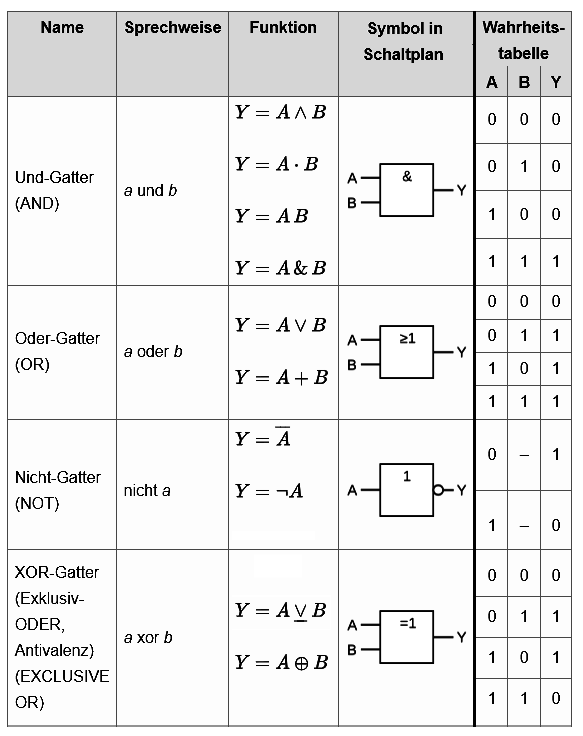

# Logikgatter

Inf-Schule.de: [Grundgatter](https://schuljahr.inf-schule.de/2019-20/rechner/digitaltechnik/gatter)

### Mnemoniken für die Schaltplan Symbole:
| Gatter        | Symbol                    | Mnemonik                                                      |
|---------------|---------------------------|---------------------------------------------------------------|
| UND-Gatter    | &                         | & = Und                                                       |
| ODER-Gatter   | ≥1                        | ist wahr wenn eins oder mehr Inputs wahr sind.                |
| NICHT-Gatter  | 1 mit einem Kreis draußen | hat einen Input, einen Output, eine 1 drinnen und einen Kreis draußen. |
| XOR-Gatter    | =1                        | ist wahr wenn die Summe der Inputs gleich eins ist.           |

### Priorität der logischen Operationen

`NICHT (¬)` vor `UND (∧)`

`UND (∧)` vor `ODER (∨)` / `XOR (⊕)`

# Konjunktion und Disjunktion

### Mnemoniken für Konjunktion und Disjunktion
- **Konjunktion** kommt von lat. „verbinden“. A **und** B werden zusammen bernutzt: UND-Verknüpfung
- **Disjunktion** kommt von lat. „trennen, unterscheiden“. A **oder** B werden getrennt bernutzt: ODER-Verknüpfung

### Disjunktive Normalform
Die disjunktive Normalform (DNF) beschreibt einen besonderen Weg, logische Aussagen aufzuschreiben. Eine Formel der Aussagenlogik ist in disjunktiver Normalform, wenn sie eine Disjunktion (Kette aus einem oder mehreren Termen, verbunden mit ODER-Verknüpfungen; z. B. `T₁ ∨ T₂ ∨ T₃`) von Konjunktionstermen ist, wobei jeder Konjunktionsterm eine **Konjunktion** (Kette aus Verknüpfungen mit UND: Z.b:`A ∧ B ∧ C`) aus **Aussagenvariablen** bildet, die jeweils entweder unnegiert oder negiert auftreten können (`A` bzw. `¬A`).

Beispiel für die disjunktive Normalform: `(¬A ∧ B ∧ C) ∨ (A ∧ ¬C) ∨ (B)`

Beispiele für die Aussagen **nicht** in disjunktiver Normalform:
| Aussage | Warum nicht DNF? |
|----------|------------------|
| `¬(A ∧ B) ∨ C` | Die Negation steht nicht direkt vor Variablen, sondern vor einer Konjunktion. | 
| `A ∨ (B ∧ (C ∨ D))` | Innerhalb eines Konjunktionsterms steckt noch eine Disjunktion. Die Form ist nicht rein „Disjunktion von Konjunktionstermen“. |
| `(A ∨ B) ∧ (C ∨ D)` | Die oberste Verknüpfung ist eine Konjunktion. | 

Eine **kanonische disjunktive Normalform (KDNF)** beschreibt eine disjunktive Normalform, die in jedem seinem Konjunktionsterm alle in dieser Aussage vorhandene Aussagenvariable enthaltet (Praktisch eine Aussage mit nicht gekürzten Termen). Jede logische Aussage kann eindeutig in einer kanonischen disjunktiven normal Form ausgedruckt werden. 

Beispiel für die kanonische disjunktive Normalform: `(¬A ∧ B ∧ ¬C) ∨ (A ∧ B ∧ C) ∨ (¬A ∧ ¬B ∧ C) ∨ (¬A ∧ ¬B ∧ ¬C)` (In diesem Fall beinhaltet die Aussage gesamt drei Aussagevariablen `A`, `B` und `C`. Und jeder der vier vorhandenen Konjunktionsterme beinhaltet alle Aussagevariablen.)

Für einen Algorithmus, wie man aus Wahrheitstabellen kanonische disjunktive Normalform bildet, sehe erste 5 Minuten von diesem Video: [Conjunctive Normal Form (CNF) and Disjunctive Normal Form (DNF)
](https://www.youtube.com/watch?v=2cgHa02s_SA).

Wieso heißt das Zeug Normalform? - Sie heißt **Normalform**, weil sie eine standardisierte, normierte Darstellungsweise für logische Formeln ist.

### Konjunktive Normalform
Als **konjunktive Normalform (KNF)** wird in der Aussagenlogik eine bestimmte Form von Formeln bezeichnet. Es handelt sich um eine Reihe an geklammerten) Oder-Termen auch gennant Disjunktionstermen, die nur aus eventuell negierten Aussagenvariablen bestehen, und diese Oder-Terme/Disjunktionstermen sind wiederum mit Und-Verknüpfungen verbunden.

Beispiel für die konjunktive Normalform:  `(A ∨ ¬B ∨ C) ∧ (¬A ∨ B) ∧ (B ∨ ¬C)`

Die **kanonische konjunktive Normalform (KKNF)** ist eine spezielle Form der KNF, in der jeder Disjunktionsterm alle in der Formel vorkommenden Aussagenvariablen enthält. KKNF ist für jede aussagenlogische Formel eindeutig bestimmbar.

Beispiel für die kanonische konjunktive Normalform:  
`(A ∨ B ∨ C) ∧ (A ∨ ¬B ∨ C) ∧ (¬A ∨ B ∨ ¬C) ∧ (¬A ∨ ¬B ∨ C)`

Für einen Algorithmus, wie man aus Wahrheitstabellen kanonische Konjunktive Normalform bildet, sehe dieses Video ab 5 Minuten: [Conjunctive Normal Form (CNF) and Disjunctive Normal Form (DNF)](https://youtu.be/2cgHa02s_SA?si=z6zOmUrgBpog9pTQ&t=298)

# Minimierung von logischen Ausdrücken.

### Minimierte Form
Eine minimierte Form einer Booleschen Formel ist eine zu ihr logisch äquivalente Darstellung, die nach einem gewählten Aufwandmaß keine überflüssigen Teile mehr enthält (d. h. sie ist bezüglich dieses Maßes nicht weiter kürzbar).
Typische Aufwandmaße sind z. B.: möglichst wenige Operatoren/Gatter, oder möglichst wenige Terme in einer gewählten Normalform (DNF bzw. KNF).

### KV-Diagramm
KV-Diagramm ist eine visuelle Methode mit denen man logische Ausdrücke minimieren kann (Oft bildet man mit KV-Diagrammen eine minimierte disjuktive Normalform). Meistens benutzt für logische Ausdrücke mit vier oder weniger Aussagenvariablen. Für detaillierte Methodenbeschreibung sehe Video: [Karnaugh Maps – Introduction](https://www.youtube.com/watch?v=3vkMgTmieZI)

### Simplifikation durch boolesche Algebra

**Vorgehensweise:** Gesetzen gegebene Aussage umformen, bis eine Identität sichtbar wird (z. B. `A + ¬A = 1` oder `A * ¬A = 0`), dann mit identität Regeln kürzen. Die Prozedur wiederholen, bis die Aussage ausreichend simplifiziert ist.

Identitäten Video: [Identitäten](https://www.youtube.com/watch?v=6B-SVpM8x2w&list=PLxfrSxK7P38X7XfG4X8Y9cdOURvC7ObMF&index=31)
| Interaktion | Addition `+` | Multiplikation `*` | XOR `⊕` |
|--------------|---------------|--------------------|----------|
| **Mit sich selbst** | `A + A = A` | `A * A = A` | `A ⊕ A = 0` |
| **Mit negiertem Selbst** | `A + ¬A = 1` | `A * ¬A = 0` | `A ⊕ ¬A = 1` |
| **Mit 1** | `A + 1 = 1` | `A * 1 = A` | `A ⊕ 1 = ¬A` |
| **Mit 0** | `A + 0 = A` | `A * 0 = 0` | `A ⊕ 0 = A` |

Strukturgesetze  Video: [Strukturgesetze](https://www.youtube.com/watch?v=iE5fbKd4Ohk&list=PLxfrSxK7P38X7XfG4X8Y9cdOURvC7ObMF&index=32)
- **Kommutativ:** `A + B = B + A`, `A * B = B * A`
- **Assoziativ:** `(A + B) + C = A + (B + C)`, `(A * B) * C = A * (B * C)`
- **Distributiv:**  
  `A * (B + C) = A*B + A*C`  
  `A + (B * C) = (A + B) * (A + C)`
- **Inverse Distributiv:**
  `A*B + A*C = A * (B + C)`
  `A + (A * B) = A`, `A * (A + B) = A`

Negation (De Morgan) Video: [De Morgan](https://www.youtube.com/watch?v=euW9JldGCFk&list=PLxfrSxK7P38X7XfG4X8Y9cdOURvC7ObMF&index=33)
- `(A * B)' = A' + B'`  
- `(A + B)' = A' * B'`

Video: [Beilspiele Simplifikation durch boolesche Algebra](https://www.youtube.com/watch?v=dLIfh2wj8Dk&list=PLxfrSxK7P38X7XfG4X8Y9cdOURvC7ObMF&index=34)

