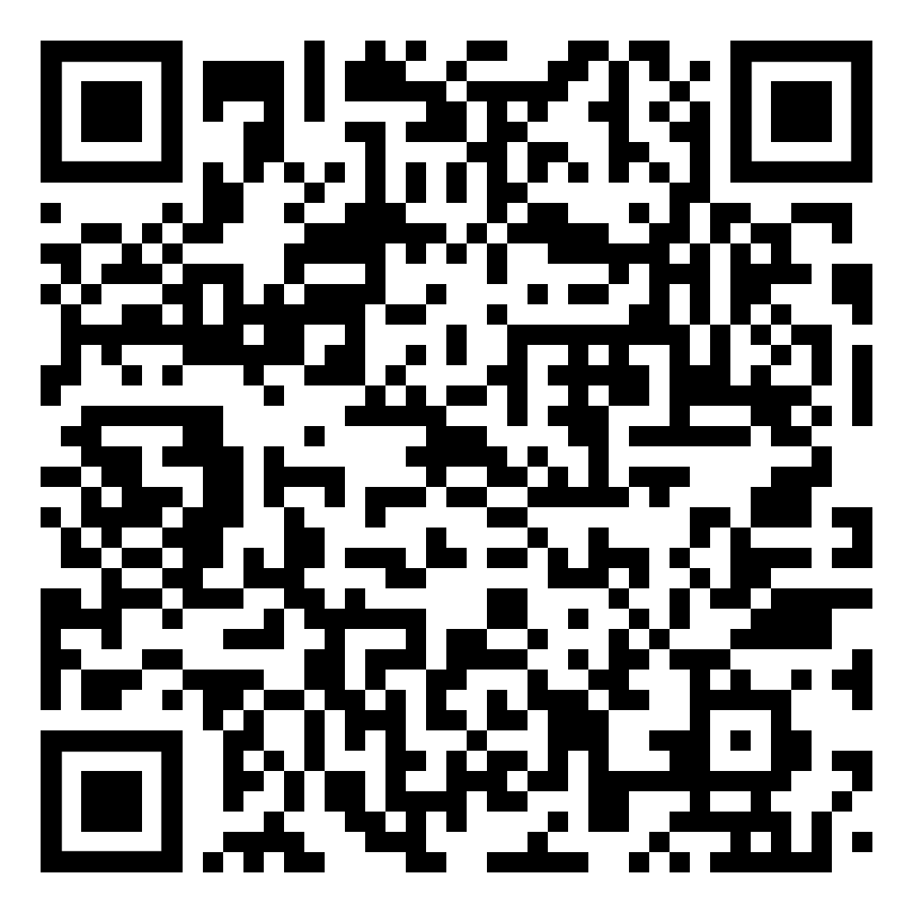

<p align="center">
	
	<br>
	<em>QR-Code scannen um dieses Dokument auf dem iPad zu öffnen</em>
</p>

1. <code>Aktualisieren Sie die Seite bei jedem Aufruf, um die neueste Version dieses Dokuments zu erhalten.</code>

# Inhaltsangabe

- [Logikgatter](#logikgatter)
- [Konjunktion und Disjunktion](#konjunktion-und-disjunktion)
- [Minimierung von logischen Ausdrücken](#minimierung-von-logischen-ausdrücken)
- [Formale Sprachen](#formale-sprachen)

# Logikgatter

Inf-Schule.de: [Grundgatter](https://schuljahr.inf-schule.de/2019-20/rechner/digitaltechnik/gatter)

<p align="center"></p>

### Mnemoniken für die Schaltplan Symbole:
| Gatter        | Symbol                    | Mnemonik                                                      |
|---------------|---------------------------|---------------------------------------------------------------|
| UND-Gatter    | &                         | & = Und                                                       |
| ODER-Gatter   | ≥1                        | ist wahr wenn eins oder mehr Inputs wahr sind.                |
| NICHT-Gatter  | 1 mit einem Kreis draußen | hat einen Input, einen Output, eine 1 drinnen und einen Kreis draußen. |
| XOR-Gatter    | =1                        | ist wahr wenn die Summe der Inputs gleich eins ist.           |


### Priorität der logischen Operationen

`NICHT (¬)` vor `UND (∧)`

`UND (∧)` vor `ODER (∨)` / `XOR (⊕)`


# Konjunktion und Disjunktion

### Mnemoniken für Konjunktion und Disjunktion
- **Konjunktion** kommt von lat. „verbinden“. A **und** B werden zusammen bernutzt: UND-Verknüpfung
- **Disjunktion** kommt von lat. „trennen, unterscheiden“. A **oder** B werden getrennt bernutzt: ODER-Verknüpfung

### Disjunktive Normalform
[Video](https://www.youtube.com/watch?v=13HCv91RGOE&list=PLxfrSxK7P38X7XfG4X8Y9cdOURvC7ObMF&index=36)

Die disjunktive Normalform (DNF) beschreibt einen besonderen Weg, logische Aussagen aufzuschreiben. Eine Formel der Aussagenlogik ist in disjunktiver Normalform, wenn sie eine Disjunktion (Kette aus einem oder mehreren Termen, verbunden mit ODER-Verknüpfungen; z. B. `T₁ ∨ T₂ ∨ T₃`) von Konjunktionstermen ist, wobei jeder Konjunktionsterm eine **Konjunktion** (Kette aus Verknüpfungen mit UND: Z.b:`A ∧ B ∧ C`) aus **Aussagenvariablen** bildet, die jeweils entweder unnegiert oder negiert auftreten können (`A` bzw. `¬A`).

Beispiel für die disjunktive Normalform: `(¬A ∧ B ∧ C) ∨ (A ∧ ¬C) ∨ (B)`

Beispiele für die Aussagen **nicht** in disjunktiver Normalform:
| Aussage | Warum nicht DNF? |
|----------|------------------|
| `¬(A ∧ B) ∨ C` | Die Negation steht nicht direkt vor Variablen, sondern vor einer Konjunktion. | 
| `A ∨ (B ∧ (C ∨ D))` | Innerhalb eines Konjunktionsterms steckt noch eine Disjunktion. Die Form ist nicht rein „Disjunktion von Konjunktionstermen“. |
| `(A ∨ B) ∧ (C ∨ D)` | Die oberste Verknüpfung ist eine Konjunktion. | 


Eine **kanonische disjunktive Normalform (KDNF)** beschreibt eine disjunktive Normalform, die in jedem seinem Konjunktionsterm alle in dieser Aussage vorhandene Aussagenvariable enthaltet (Praktisch eine Aussage mit nicht gekürzten Termen). Jede logische Aussage kann eindeutig in einer kanonischen disjunktiven normal Form ausgedruckt werden. 

Beispiel für die kanonische disjunktive Normalform: `(¬A ∧ B ∧ ¬C) ∨ (A ∧ B ∧ C) ∨ (¬A ∧ ¬B ∧ C) ∨ (¬A ∧ ¬B ∧ ¬C)` (In diesem Fall beinhaltet die Aussage gesamt drei Aussagevariablen `A`, `B` und `C`. Und jeder der vier vorhandenen Konjunktionsterme beinhaltet alle Aussagevariablen.)

Wieso heißt das Zeug Normalform? - Sie heißt **Normalform**, weil sie eine standardisierte, normierte Darstellungsweise für logische Formeln ist.

### Konjunktive Normalform
Als **konjunktive Normalform (KNF)** wird in der Aussagenlogik eine bestimmte Form von Formeln bezeichnet. Es handelt sich um eine Reihe an geklammerten) Oder-Termen auch gennant Disjunktionstermen, die nur aus eventuell negierten Aussagenvariablen bestehen, und diese Oder-Terme/Disjunktionstermen sind wiederum mit Und-Verknüpfungen verbunden.

Beispiel für die konjunktive Normalform:  `(A ∨ ¬B ∨ C) ∧ (¬A ∨ B) ∧ (B ∨ ¬C)`

Die **kanonische konjunktive Normalform (KKNF)** ist eine spezielle Form der KNF, in der jeder Disjunktionsterm alle in der Formel vorkommenden Aussagenvariablen enthält. KKNF ist für jede aussagenlogische Formel eindeutig bestimmbar.

Beispiel für die kanonische konjunktive Normalform:  
`(A ∨ B ∨ C) ∧ (A ∨ ¬B ∨ C) ∧ (¬A ∨ B ∨ ¬C) ∧ (¬A ∨ ¬B ∨ C)`

Für einen Algorithmus, wie man aus Wahrheitstabellen kanonische Konjunktive Normalform bildet, sehe dieses Video ab 5 Minuten: [Conjunctive Normal Form (CNF) and Disjunctive Normal Form (DNF)](https://youtu.be/2cgHa02s_SA?si=z6zOmUrgBpog9pTQ&t=298)

# Minimierung von logischen Ausdrücken

### Minimierte Form
Eine minimierte Form einer Booleschen Formel ist eine zu ihr logisch äquivalente Darstellung, die nach einem gewählten Aufwandmaß keine überflüssigen Teile mehr enthält (d. h. sie ist bezüglich dieses Maßes nicht weiter kürzbar).
Typische Aufwandmaße sind z. B.: möglichst wenige Operatoren/Gatter, oder möglichst wenige Terme in einer gewählten Normalform (DNF bzw. KNF).

### KV-Diagramm
KV-Diagramm ist eine visuelle Methode mit denen man logische Ausdrücke minimieren kann (Oft bildet man mit KV-Diagrammen eine minimierte disjuktive Normalform). Meistens benutzt für logische Ausdrücke mit vier oder weniger Aussagenvariablen. Für Kurze Methodenbeschreibung sehe Video: [Karnaugh Maps – Introduction](https://www.youtube.com/watch?v=3vkMgTmieZI)

Detaillierte Beschreibung: [Playlist Ep40-Ep45](https://www.youtube.com/watch?v=pPHxpiJfyS8&list=PLxfrSxK7P38X7XfG4X8Y9cdOURvC7ObMF&index=40)

### Simplifikation durch boolesche Algebra


**Vorgehensweise:** Mit Gesetzen gegebene Aussage umformen, bis eine Identität sichtbar wird (z. B. `A + ¬A = 1` oder `A * ¬A = 0`), dann mit identität Regeln kürzen. Die Prozedur wiederholen, bis die Aussage ausreichend simplifiziert ist.

Identitäten Video: [Identitäten](https://www.youtube.com/watch?v=6B-SVpM8x2w&list=PLxfrSxK7P38X7XfG4X8Y9cdOURvC7ObMF&index=31)
| Interaktion | Addition `+` | Multiplikation `*` | XOR `⊕` |
|--------------|---------------|--------------------|----------|
| **Mit sich selbst** | `A + A = A` | `A * A = A` | `A ⊕ A = 0` |
| **Mit negiertem Selbst** | `A + ¬A = 1` | `A * ¬A = 0` | `A ⊕ ¬A = 1` |
| **Mit 1** | `A + 1 = 1` | `A * 1 = A` | `A ⊕ 1 = ¬A` |
| **Mit 0** | `A + 0 = A` | `A * 0 = 0` | `A ⊕ 0 = A` |


Strukturgesetze  Video: [Strukturgesetze](https://www.youtube.com/watch?v=iE5fbKd4Ohk&list=PLxfrSxK7P38X7XfG4X8Y9cdOURvC7ObMF&index=32),
(De Morgan) Video: [De Morgan](https://www.youtube.com/watch?v=euW9JldGCFk&list=PLxfrSxK7P38X7XfG4X8Y9cdOURvC7ObMF&index=33)

| Gesetz | ODER `+` | UND `*` |
|---------|------------------|------------------------|
| **Kommutativgesetz** | `A + B = B + A` | `A * B = B * A` |
| **Assoziativgesetz** | `(A + B) + C = A + (B + C)` | `(A * B) * C = A * (B * C)` |
| **Distributivgesetz** | `A + (B * C) = (A + B) * (A + C)` | `A * (B + C) = A*B + A*C` |
| **De Morgan** | `¬(A + B) = ¬A * ¬B` | `¬(A * B) = ¬A + ¬B` |
  

Video: [Beilspiele Simplifikation durch boolesche Algebra](https://www.youtube.com/watch?v=dLIfh2wj8Dk&list=PLxfrSxK7P38X7XfG4X8Y9cdOURvC7ObMF&index=34)

### Addierer
[PlayList(erste 2 Videos 20min gesamt)](https://www.youtube.com/watch?v=7a8hRhPL9bs&list=PL1C2GgOjAF-IvXYD914yG_T8hxoQmPhTF&index=1)


# Formale Sprachen

Ein Alphabet **Σ** ist eine endliche Menge von Symbolen. Ein Alphabet **Σ** wird in geschweiften Klammern angegeben, und jedes Symbol wird in doppelte Anführungszeichen gesetzt. Zum Beispiel: **Σ = {"a", "b", "xx"}**. Dabei ist "xx", ein einzelnes Symbol.

**Σ\*** (Sigma-Stern) besteht aus allen möglichen Kombinationen von Symbolen aus **Σ**, mit einer Länge von 0 oder größer. Jede dieser Symbolkombinationen wird **Wort** genannt. Auch das Wort der Länge 0 gehört dazu das **leere Wort**, bezeichnet mit **ε** (Epsilon). Bemerkung: Eine Menge, die das leere Wort enthält , ist **nicht** die leere Menge ( {ε} ≠ ∅ ). Noch eine unerwartete Eigenschaft ist das die Stern-Operation auf der leeren Menge ergibt eine Menge, die ein einziges Element enthält, nämlich das leere Wort:  **∅\*** = **{ε}**

Eine **formale Sprache** **L** ist eine **Teilmengen** von **Σ\***,  für die ein Satz von **formalen Regeln** existiert, der eindeutig bestimmen kann, ob ein Wort zu **L** gehört oder nicht. (Die Bedingung der Existenz solcher **formalen Regeln** wird in vielen Quellen oft weggelassen, muss jedoch bei uns vorhanden sein.) 

Eine formale Sprache kann durch eine Grammatik definiert werden. In unserem Fall verwenden wir Typ 2 Grammatik oder Kontextfreie Grammatik. Eine **kontextfreie Grammatik (KFG)** ist ein **Viertupel** (also eine geordnete Menge der Form): **G = (V, Σ, P, S)**
Dabei gilt:

- **V** ist die endliche Menge der **Nichtterminalsymbole**.  
- **Σ** ist die endliche Menge der **Terminalsymbole** (das Alphabet).  
- **P** ist die Menge der **Produktionsregeln**.  
- **S ∈ V** ist das **Startsymbol**.

Bemerkungen zur Grammatik:

- Das **Startsymbol S** ist keine Menge aus Symbolen, sondern ein einzelnes Symbol aus der Menge der Nichtterminalsymbole V.  
- Die **Reihenfolge der Elemente** im Viertupel **G = (V, Σ, P, S)** ist wichtig.

Beispielgrammatik: 
```
G = (V, Σ, P, S) 
Σ = { 'U', 'S', '1', '2', '3' }
V = { <linie>, <U-Bahn>, <S-Bahn>, <2Ziffer>, <3Ziffer> }
S = <linie>
P = {
<linie>   → <U-Bahn>,             (R1)
<linie>   → <S-Bahn>,             (R2)
<U-Bahn>  → 'U' <2Ziffer>,        (R3)
<S-Bahn>  → 'S' <3Ziffer>,        (R4)
<2Ziffer> → '1',                  (R5)
<2Ziffer> → '2',                  (R6)
<3Ziffer> → <2Ziffer>,            (R7)
<3Ziffer> → '3',                  (R8)
}
```
Beispiel-Linksableitung für 'U2':

```
            (R1)              (R2)                   (R4)
 <linie>  ———————→ <U-Bahn> ———————→ 'U' <2Ziffer> ———————→ 'U' '2'           
```

Syntax ist ein Regelwerk, der bestimmt, ob ein Wort zu der Sprache gehört oder nicht. Syntaktische Fehler: Verletzen diese Regeln, sodass die Zeichenkette nicht wohlgeformt ist (z. B. fehlende Klammer).

Semantik: Ordnet wohlgeformten Ausdrücken eine Bedeutung zu, z. B. mittels einer Interpretations-/Bewertungsfunktion; in Programmiersprachen beschreibt sie, was ein syntaktisch gültiges Programm bewirkt. Semantische Fehler: Treten auf, wenn ein syntaktisch korrekter Ausdruck im gegebenen Modell eine ungültige Bedeutung at (z. B.  wenn gegebene Wort nicht interpretierbar ist). 

### Syntax-Diagramme  
Syntax-Diagramme sind grafische Darstellungen von Produktionsregeln einer Sprache. Für weitere Informationen sehe diese Seite: [inf-schule.de Fachkonzept - Syntaxdiagramm
](https://inf-schule.de/automaten-sprachen/sprachenundautomaten/sprachbeschreibung/syntaxdiagramme/konzept_syntaxdiagramm)
