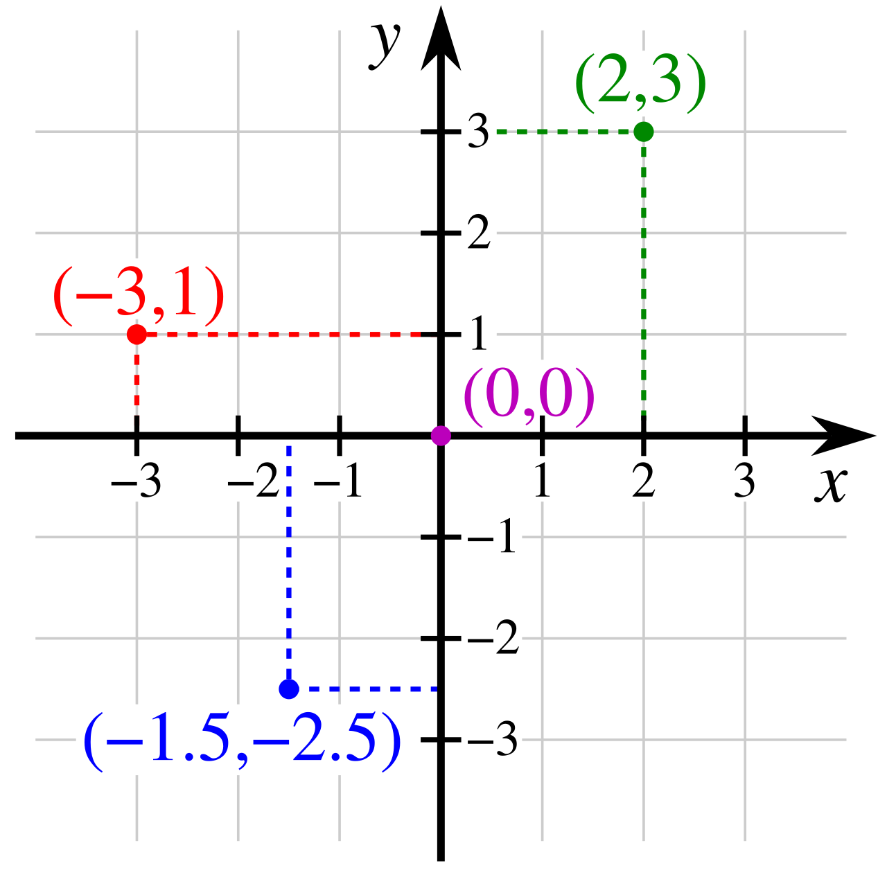
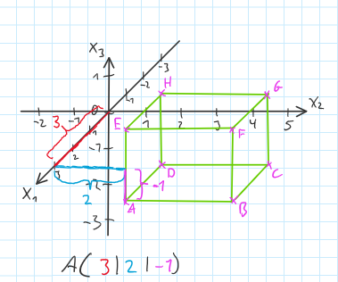
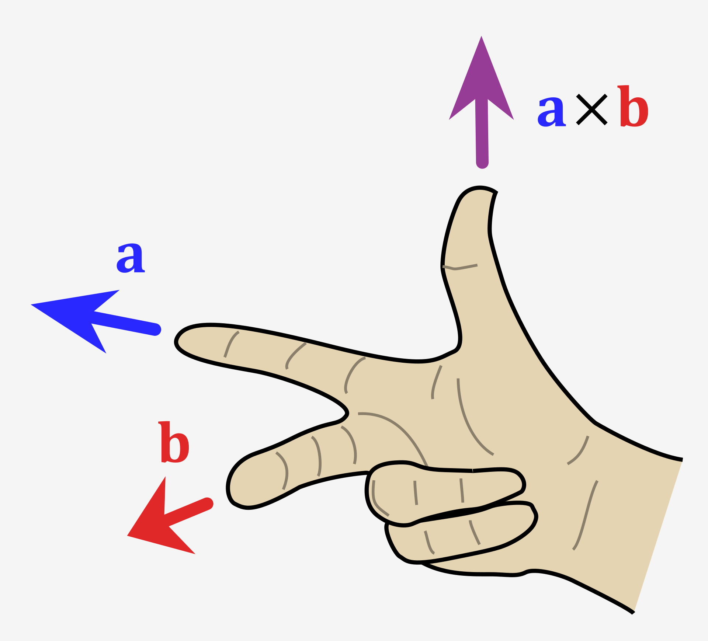

# Analytische Geometrie
**Analytische Geometrie:** Ein Teilgebiet der Mathematik, der algebraische Methoden nutzt, um geometrische Eigenschaften und Beziehungen in einem Koordinatensystem zu beschreiben. Analytische Geometrie ermöglicht die Lösung geometrischer Probleme durch algebraische Methoden.

## Punkte
- **2D-Punkt:** Ein Objekt in der Ebene, das durch ein geordnetes Paar von Zahlen $(x| y)$ dargestellt wird. Hierbei repräsentiert $x$ die horizontale Position und $y$ die vertikale Position im zweidimensionalen Raum. 
- **3D-Punkt:** Ein Objekt im Raum, das durch ein geordnetes Tripel von Zahlen $(x| y| z)$ charakterisiert wird. $x$, $y$ und $z$ repräsentieren die Positionen entlang der x-, y- und z-Achsen im dreidimensionalen Raum.
- Die Menge der Punkte kann wie folgt angegeben werden: $L = \\{(t \mid t - 5) \mid t \in \mathbb{R} \text{  beliebig} \\}$
## Lineare Gleichungen
Eine **lineare Gleichung** ist eine algebraische Gleichung, dessen beide Seiten nur aus einer Summe aus Konstanten oder Variablen(im ersten Potenz multipliziert durch konstanten) besteht. 

**Beispiel:** `ax + by + c = 0`, wobei `a`, `b`, und `c` konstante Werte sind und `x` und `y` Variablen.


## Lineare Gleichungssysteme
Ein **lineares Gleichungssystem** besteht aus zwei oder mehr linearen Gleichungen, die gemeinsame Variablen haben.

**Beispiel:**
```
2x - y = 5
 x + y = 7
```

## Lösen eines linearen Gleichungssystems
Beim Lösen eines linearen Gleichungssystems besteht das Ziel darin, die Werte für die Variablen zu finden, die alle Gleichungen des Systems gleichzeitig erfüllen. Am häufigsten wird zur Lösung linearer Gleichungssysteme das Substitutionsverfahren oder das Gauß-Verfahren verwendet. Substitutionsmethode passt für Gleichungssysteme mit zwei Variablen und Gauss-Verfahren für größere Systeme mit mehr Variablen.

### Substitutionsmethode
**Substitutionsmethode:** Ein algebraisches Verfahren zur Lösung linearen Gleichungssystems, indem der Wert einer Variablen aus einer Gleichung in andere Gleichungen eingesetzt wird. Dies vereinfacht das Gleichungssystem zu einer einzelnen Gleichung mit einer Variablen, die dann gelöst werden kann. Schritte der Substitutionsmethode:

1. **Isolieren einer Variablen:** Wähle eine der Gleichungen und löse sie nach einer Variablen auf.
3. **Einsetzen:** Ersetze die isolierte Variable in alle andere Gleichungen (Dies eliminiert die erste Gleichung aus dem System).
4. Wiederholen Sie die Schritte 1 und 2, bis entweder nur noch eine Gleichung übrig ist oder die verbleibenden Gleichungen keine Variablen mehr gemeinsam haben.
   - Wenn der Substitutionsprozess zu einer nicht wahren Gleichung (`1=0`, `3=-4`) führte, dann hat dieses Gleichungssystem keine Lösungen.
   - Wenn im Substitution Prozess eine der Gleichungen zu einer Ware Gleichung ohne Variablen kürzt (`1=1`, `0=0`), dann entfernen Sie diese Gleichung aus dem System, sie ist redundant.
5. **Lösen der neuen Gleichung:**
   - Wenn Sie nur noch eine Gleichung mit einer Variablen haben, lösen Sie diese. Auf diese Weise erhalten Sie den Wert einer der Variablen. Suchen Sie dann in den vorherigen Schritten die Gleichung, die die Variable enthält, deren Wert Sie gerade gelernt haben, und eine weitere Variable, ersetzen Sie den Wert und lösen Sie diese. Wiederholen Sie den letzten Schritt, bis Sie die Werte aller Variablen gefunden haben.
   - Wenn Sie eine Gleichung mit mehreren Variablen übrig haben, sind alle Werte der Variablen, die diese Gleichung erfüllen, Lösungen des Systems.

[weitere Informationen zu Substitutionsmethode](https://en.wikipedia.org/wiki/System_of_linear_equations#Elimination_of_variables)
## Gaußsches Eliminationsverfahren
Das **Gaußsche Eliminationsverfahren**, ist Verfahren zur Lösung linearer Gleichungssysteme. Es transformiert das System in eine obere Dreiecksform, von der aus die Lösungen leicht durch Rückwärtseinsetzen gefunden werden können.

#### Schritte des Gaußschen Eliminationsverfahrens
1. **Auswahl des führenden Elements**: Wähle das erste Element der ersten Spalte, das nicht null ist, als führendes Element.
2. **Zeilenanpassung**: Tausche nötigenfalls die Zeilen, sodass das führende Element in der aktuellen Zeile an der ersten Position steht.
3. **Elimination**: Nutze das führende Element, um alle Einträge unterhalb dessen auf null zu setzen. Subtrahiere dazu ein Vielfaches der führenden Zeile von den darunterliegenden Zeilen, sodass die Elemente unterhalb null werden.
4. **Wiederholung für die nächste Spalte**: Wiederhole die Schritte 1 bis 3 für die nächste Spalte und Zeile, bis das gesamte System auf eine obere Dreiecksform reduziert ist.
5. **Rückwärtseinsetzen**: Beginne bei der letzten Gleichung und löse sie nach der letzten Variablen auf. Setze diesen Wert in die vorherige Gleichung ein, um die nächste Variable zu finden, und fahre so fort, bis alle Variablen bestimmt sind.

 [detaillierte Beschreibung des Algorithmus](https://en.wikipedia.org/wiki/Gaussian_elimination)

## Polynomfunktion n-ten Grades
**Polynomfunktion n-ten Grades**: Eine Polynomfunktion n-ten Grades ist eine Funktion der Form $P(x) = a_nx^n + a_{n-1}x^{n-1} + \ldots + a_1x + a_0$, wobei $a_n, a_{n-1}, \ldots, a_1, a_0$ Koeffizienten sind und $a_n \neq 0$. 


## Polynominterpolation
Ein Polynom vom Grad $n$ kann durch $n+1$ beliebige Punkte $(x_1, y_1), (x_2, y_2), \ldots, (x_{n+1}, y_{n+1})$ eindeutig bestimmt werden, vorausgesetzt, dass keine zwei dieser Punkte dieselben $x$-Koordinaten haben (dass keine zwei Punkte übereinander liegen). [Video](https://www.youtube.com/watch?v=z1YUTRG3ngM)

### Schritte
1. **Aufstellen des Gleichungssystems**: Für jeden Punkt wird eine Gleichung der Form $a_nx_i^n + a_{n-1}x_i^{n-1} + \ldots + a_1x_i + a_0 = y_i$ erstellt.
2. **Lösen des Gleichungssystems**: Das resultierende lineare Gleichungssystem aus n+1 Gleichungen für die n+1 Unbekannten (die Koeffizienten $a_0, a_1, \ldots, a_n$) wird gelöst.

Die gleiche Methode kann auch verwendet werden, um ein Polynom n-ten Grades zu finden, das durch mehr als n + 1 Punkte verläuft. In diesem Fall funktioniert sie jedoch nicht für jeden Satz von Punkten.

Auch, wenn wir eine Polynomfunktion finden wollen, die nicht nur durch eine Reihe von Punkten verläuft, sondern an den Punkten auch bestimmte Eigenschaften aufweist, d. h. beispielsweise an einem der Punkte $(x_p| y_p)$ ein lokales Maximum hat. In diesem Fall erstellen wir auch ein System linearer Gleichungen, wobei wir die Gleichungen jetzt auf der Grundlage der Eigenschaften zusammenstellen, die die Funktion an diesen Punkten haben muss. Beispielsweise wissen wir für einen lokalen Maximumpunkt, dass die Funktion eine Ableitung gleich 0 haben muss und auch durch diesen Punkt verläuft. Das heißt, wir erhalten zwei Gleichungen: $f(x_p)=y_p$ und $f'(x_p)=0$ 


### Beispiel
Betrachten wir die Punkte $(1| 2), (2| 3), (3| 5)$. Ein Polynom 2-ten Grades soll durch diese Punkte bestimmt werden:
$P(x) = ax^2 + bx + c$

#### Aufstellen des Gleichungssystems
Setzen Sie die gegebenen Punkte in das Polynom ein:
``` math
\begin{align*}
a(1)^2 + b(1) + c &= 2 \\
a(2)^2 + b(2) + c &= 3 \\
a(3)^2 + b(3) + c &= 5
\end{align*}
```
Das ergibt das System:
```math
\begin{align*}
1a + 1b + 1c &= 2 \\
4a + 2b + 1c &= 3 \\
9a + 3b + 1c &= 5
\end{align*}
```
#### Lösen des Gleichungssystems
Dieses System kann nun mit Gaußsches Eliminationsverfahren gelöst werden. Nach Lösung erhält man die Koeffizienten $a$, $b$, und $c$, die das gesuchte Polynom definieren $a = 0.5$, $b = -0.5$, und $c = 2$, sodass das resultierende Polynom lautet: $P(x) = 0.5x^2 - 0.5x + 2$ Dieses Polynom verläuft durch alle drei gegebenen Punkte, was durch Einsetzen der $x$-Werte in $P(x)$ überprüft werden kann.


## Kartesisches Koordinatensystem
In einem dreidimensionalen kartesischen Koordinatensystem wird jedes Punkt durch drei Zahlenwerte beschrieben. Komplexere Objekte können durch Gleichungen dargestellt werden, deren Lösungsmengen alle Punkte umfassen, die zu diesen Objekten gehören. In einem zweidimensionalen Koordinatensystem können Sie alle Längen und Winkel direkt von der Zeichnung auf Papier messen und sie werden korrekt sein. Ein Blatt Papier kann den dreidimensionalen Raum jedoch nicht vollständig abbilden. Wenn dreidimensionale Objekte auf Papier gezeichnet werden, sind sie daher nicht geeignet, um Länge, Winkel und die meisten anderen Eigenschaften von diesen Objekte zu messen. Dafür ist die analytische Geometrie erforderlich.

<p align="center">
	
	<br>
	<em>2d Kartesisches Koordinatensystem</em>
</p>
<p align="center">
	
	<br>
	<em>3d Kartesisches Koordinatensystem</em>
</p>

## Vektoren

Ein **Vektor** ist ein mathematisches Objekt, das eine Größe und eine Richtung besitzt. Mathematisch wird ein Vektor im Raum durch seine Koordinaten in der Form $(x, y, z)$ dargestellt, wobei $x$, $y$, und $z$ die Komponenten des Vektors entlang der $x$-, $y$-, und $z$-Achsen sind.

### **Freier Vektor**
Ein **freier Vektor** ist ein Vektor, der unabhängig von seiner Position im Raum definiert ist. Das bedeutet, dass seine Eigenschaften wie Richtung und Länge gleich bleiben, unabhängig davon, wo er im Koordinatensystem platziert wird.

### **Ortsvektor**
Ein **Ortsvektor** ist ein Vektor, der vom Ursprung des Koordinatensystems zu einem Punkt P führt. Er beschreibt die Position dieses Punktes im Raum. In der Regel wird ein Ortsvektor als $\vec{OP}$ notiert, wobei $O$ der Ursprung und $P$ der Endpunkt des Vektors ist.

### Schreibweisen für Vektoren
Vektoren können auf verschiedene Weisen dargestellt werden:

- **Mit einem Pfeil über dem Buchstaben:** $\vec{a}$

- **Vektor von einem Punkt zu einem anderen Punkt**: Gegeben zwei Punkte $A = (x_1| y_1| z_1)$ und $B = (x_2| y_2| z_2)$, ist der Vektor
  $\vec{AB} = (x_2 - x_1, y_2 - y_1, z_2 - z_1)$.

- **Mit eine vertikale Klammer:**
```math
\begin{pmatrix}
a_x \\
a_y \\
a_z
\end{pmatrix}
```

### Addition von Vektoren
**Vektoraddition:** Die Addition zweier Vektoren $\vec{a} = (a_x, a_y, a_z)$ und $\vec{b} = (b_x, b_y, b_z)$ erfolgt komponentenweise. Das Ergebnis ist ein neuer Vektor $\vec{c} = (a_x + b_x, a_y + b_y, a_z + b_z)$.

#### Beispiel
Seien $\vec{a} = (3, 4, 5)$ und $\vec{b} = (1, 0, 2)$, dann ist $\vec{c} = \vec{a} + \vec{b} = (3+1, 4+0, 5+2) = (4, 4, 7)$.

### Subtraktion von Vektoren
**Vektorsubtraktion:** Die Subtraktion von Vektor $\vec{b}$ von Vektor $\vec{a}$ erfolgt ebenfalls komponentenweise: $\vec{c} = \vec{a} - \vec{b} = (a_x - b_x, a_y - b_y, a_z - b_z)$.

#### Beispiel
Für $\vec{a} = (3, 4, 5)$ und $\vec{b} = (1, 0, 2)$ ist $\vec{c} = \vec{a} - \vec{b} = (3-1, 4-0, 5-2) = (2, 4, 3)$.

### Streckung von Vektoren
**Vektorstreckung (Skalierung):** Ein Vektor $\vec{a} = (a_x, a_y, a_z)$ kann durch eine Skalierung mit einem Skalar $k$ gestreckt werden, wodurch ein neuer Vektor $\vec{b} = k\vec{a} = (ka_x, ka_y, ka_z)$ entsteht.

#### Beispiel
Für $\vec{a} = (3, 4, 5)$ und $k = 2$ ist $\vec{b} = 2\vec{a} = (2\cdot3, 2\cdot4, 2\cdot5) = (6, 8, 10)$.

### Betrag eines Vektors

Der **Betrag eines Vektors** $\vec{v}$, oft auch als die Länge oder Magnitude des Vektors bezeichnet, misst die "Größe" des Vektors. Für einen Vektor $\vec{v} = (v_1, v_2, v_3)$ im dreidimensionalen Raum wird der Betrag $|\vec{v}|$ durch die folgende Formel bestimmt:

```math
|\vec{v}| = \sqrt{v_1^2 + v_2^2 + v_3^2}
```

#### **Beispiel**
Betrachten Sie den Vektor $\vec{v} = (3, 4, 12)$. Der Betrag dieses Vektors wird wie folgt berechnet:

```math
|\vec{v}| = \sqrt{3^2 + 4^2 + 12^2} = \sqrt{9 + 16 + 144} = \sqrt{169} = 13
```


## Skalarprodukt

### Definition und Formel im dreidimensionalen Raum
**Skalarprodukt**: Das Skalarprodukt zweier Vektoren $\vec{a}$ und $\vec{b}$  wird definiert als:

$$ \vec{a} \cdot \vec{b} = |\vec{a}| |\vec{b}| \cos(\theta) $$

wobei $\theta$ der kleinere Winkel zwischen den Vektoren $\vec{a}$ und $\vec{b}$ ist.

Man kann Skalierprodukt von zwei dreidimensionalen Vektoren mit folgenden Formeln berechnen:

$$ \vec{a} \cdot \vec{b} = a_x b_x + a_y b_y + a_z b_z $$

wobei $(a_x, a_y, a_z)$ und $(b_x, b_y, b_z)$ die kartesischen Koordinaten der Vektoren $\vec{a}$ bzw. $\vec{b}$ sind.

### Eigenschaften des Skalarprodukts
- **Kommutativität**: $\vec{a} \cdot \vec{b} = \vec{b} \cdot \vec{a}$
- **Distributivität über Vektoraddition**: $\vec{a} \cdot (\vec{b} + \vec{c}) = \vec{a} \cdot \vec{b} + \vec{a} \cdot \vec{c}$
- **Assoziativität mit Skalaren**: $(k \vec{a}) \cdot \vec{b} = k (\vec{a} \cdot \vec{b})$
- **Orthogonalität**: Zwei Vektoren sind orthogonal (senkrecht zueinander), wenn ihr Skalarprodukt null ist, $\vec{a} \cdot \vec{b} = 0$.

### Formel für die Länge eines Vektors
Die Länge (oder der Betrag) eines Vektors $\vec{v}$, kann man berechnen indem man Wurzel von skalar-produkt von dem Vetektor mit sich selbst kalkuliert:

$$ |\vec{v}| = \sqrt{\vec{v} \cdot \vec{v}} $$

### Verwendung des Skalarprodukts zur Winkelberechnung
Das Skalarprodukt kann auch verwendet werden, um den Winkel $\theta$ zwischen zwei Vektoren zu berechnen. Die Formel hierfür ist:

$$ \theta = \cos^{-1} \left( \frac{\vec{a} \cdot \vec{b}}{|\vec{a}| |\vec{b}|} \right) $$


## Kreuzprodukt

### Definition und Formel im dreidimensionalen Raum
<p align="center">
	
	<br>
	<em>Rechte-Hand-Regel</em>
</p>

**Kreuzprodukt**: Das Kreuzprodukt zweier Vektoren $\vec{a}$ und $\vec{b}$ im dreidimensionalen Raum wird definiert als ein Vektor $\vec{c}$, der senkrecht zu beiden Vektoren steht und dessen Länge dem Flächeninhalt des Parallelogramms entspricht, das von $\vec{a}$ und $\vec{b}$ aufgespannt wird. Die Richtung von $\vec{c}$ wird durch die Rechte-Hand-Regel bestimmt.

Das Kreuzprodukt wird berechnet mit der Formel: $\vec{a} \times \vec{b} =$

```math
\begin{pmatrix}
a_y b_z - a_z b_y \\
a_z b_x - a_x b_z \\
a_x b_y - a_y b_x
\end{pmatrix}
```

wobei $(a_x, a_y, a_z)$ und $(b_x, b_y, b_z)$ die kartesischen Koordinaten der Vektoren $\vec{a}$ bzw. $\vec{b}$ sind.

### Eigenschaften des Kreuzprodukts
- **Antikommutativität**: $\vec{a} \times \vec{b} = -(\vec{b} \times \vec{a})$
- **Distributivität über Vektoraddition**: $\vec{a} \times (\vec{b} + \vec{c}) = \vec{a} \times \vec{b} + \vec{a} \times \vec{c}$
- **Skalarfaktor**: $k (\vec{a} \times \vec{b}) = (k \vec{a}) \times \vec{b} = \vec{a} \times (k \vec{b})$

### Länge des Kreuzprodukts
Die Länge (oder der Betrag) des Kreuzprodukts $\vec{c} = \vec{a} \times \vec{b}$ entspricht dem Flächeninhalt des von $\vec{a}$ und $\vec{b}$ aufgespannten Parallelogramms und wird berechnet als:

$$ |\vec{c}| = |\vec{a}| |\vec{b}| \sin(\theta) $$

wobei $\theta$ der Winkel zwischen den Vektoren $\vec{a}$ und $\vec{b}$ ist.

### Verwendung des Kreuzprodukts zur Flächenberechnung
Das Kreuzprodukt kann verwendet werden, um die Fläche eines Parallelogramms zu berechnen, das von zwei Vektoren umschlossen wird. Für ein Dreieck, das von den Vektoren $\vec{a}$ und $\vec{b}$ aufgespannt wird, beträgt die Fläche die Hälfte des Betrags des Kreuzprodukts:

$$ \text{Fläche des Dreiecks} = \frac{1}{2} |\vec{a} \times \vec{b}| $$


## Geraden im dreidimensionalen Raum
 Die Darstellung von Geraden im dreidimensionalen Raum erfolgt typischerweise durch die Verwendung von Vektoren. Hierbei wird eine Gerade durch einen Stützvektor und einen Richtungsvektor definiert.
 
 ### Definition einer Geraden
 Eine **Gerade** im Raum kann definiert werden durch:
 Eine **Gerade** im Raum kann definiert werden durch:

- **Stützvektor $\vec{p}$:** Ein Punkt, durch den die Gerade verläuft.
- **Richtungsvektor $\vec{v}$:** Gibt die Richtung der Geraden an.

 
 Die **Parameterform** einer Geraden ist gegeben durch die Gleichung:
 wobei $t \in \mathbb{R}$ der Parameter ist.
 Sei $\vec{p} = (1, 2, 3)$ und $\vec{v} = (4, 5, 6)$. Dann lautet die Gleichung der Geraden:
 
 $$\vec{r}(t) = (1, 2, 3) + t(4, 5, 6)$$

Sei $\mathbf{p} = (1, 2, 3)$ und $\mathbf{v} = (4, 5, 6)$. Dann lautet die Gleichung der Geraden:

$$\mathbf{r}(t) = (1, 2, 3) + t(4, 5, 6)$$
 
 ### Punktprobe
 Für den Punkt $\vec{q} = (5, 7, 9)$ prüft man:

 $$(5, 7, 9) = (1, 2, 3) + t(4, 5, 6)$$

 Daraus folgt durch Komponentenvergleich und Lösung des Gleichungssystems, dass $t = 1$ eine mögliche Lösung ist, also liegt $\vec{q}$ auf der Geraden.

### Analytische Geometrie zur Bestimmung der Lage von Geraden

Die **analytische Geometrie** bietet Methoden zur Untersuchung der relativen Lage von Geraden im Raum [Video](https://studyflix.de/mathematik/lagebeziehungen-von-geraden-5826):
1. **Parallele Geraden:** Zwei Geraden sind parallel, wenn ihre Richtungsvektoren linear abhängig sind. Dies prüft man durch den Vergleich der Vektoren.
2. **Identische Geraden:** Zwei Geraden sind identisch, wenn sie denselben Stützpunkt und Richtungsvektor haben, oder wenn ein Punkt der einen Geraden durch eine Skalierung des Richtungsvektors auf der anderen Geraden liegt.
3. **Schnittwinkel und Schnittpunkt:** Der Schnittpunkt zweier Geraden kann gefunden werden, indem man ihre Gleichungen gleichsetzt und das resultierende Gleichungssystem löst. Der Schnittwinkel lässt sich über das Skalarprodukt der Richtungsvektoren berechnen.
4. Geraden werden als **windschief** bezeichnet, wenn sie sich weder schneiden noch parallel zueinander sind.

#### Beispiel

Betrachten wir zwei Geraden:

- $\vec{r}_1(t) = (1, 2, 3) + t(4, 5, 6)$
- $\vec{r}_2(s) = (-1, -2, -3) + s(2, 2.5, 3)$

 Diese Geraden sind parallel, da $\vec{v}_2 = 0.5\vec{v}_1$ ( $\vec{v}_1$ und  $\vec{v}_2$ sind Richtungsvektoren von geraden $\vec{r}_1(t)$, $\vec{r}_2(t)$ ). Sie haben keinen Schnittpunkt, da sie nicht identisch sind.

 ## Ebenen im Raum

Eine **Ebene** ist eine zweidimensionale Fläche im dreidimensionalen Raum, die durch mindestens drei nicht auf einer Geraden liegende Punkte definiert werden kann.

### Parameterform der Ebene

Die **Parameterform** einer Ebene wird durch einen Punkt und zwei nicht parallele Richtungsvektoren definiert. Sie lautet:

$$\vec{x} = \vec{p} + r\vec{u} + s\vec{v}$$

- $\vec{p}$ ist der Stützvektor (ein Punkt auf der Ebene),
- $\vec{u}$ und $\vec{v}$ sind die Richtungsvektoren der Ebene,
- $r$ und $s$ sind Parameter.

#### Beispiel

Gegeben sei der Punkt $\vec{p} = (1, 2, 3)$ und die Vektoren $\vec{u} = (4, 0, 0)$ und $\vec{v} = (0, 5, 0)$. Die Parameterform der Ebene ist dann:

$$\vec{x} = (1, 2, 3) + r(4, 0, 0) + s(0, 5, 0)$$

### Normalenform der Ebene

Die **Normalenform** der Ebene verwendet einen Normalenvektor, der senkrecht zur Ebene steht. Sie wird definiert als:

$$\vec{n} \cdot (\vec{x} - \vec{p}) = 0$$

- $\vec{n}$ ist der Normalenvektor der Ebene,
- $\vec{x}$ ist ein beliebiger Punkt auf der Ebene,
- $\vec{p}$ ist ein spezifischer Punkt auf der Ebene (Stützvektor).

#### Beispiel

Für die Ebene mit dem Normalenvektor $\vec{n} = (1, 1, 1)$ und dem Punkt $\vec{p} = (1, 2, 3)$ lautet die Normalenform:

$$(1, 1, 1) \cdot ((x, y, z) - (1, 2, 3)) = 0$$

### Koordinatenform der Ebene

Die **Koordinatenform** der Ebene ist eine algebraische Darstellung, die direkt aus der Normalenform abgeleitet wird, indem das Skalarprodukt ausmultipliziert und umgeformt wird. Sie lautet:

$$ax + by + cz = d$$

- $a, b, c$ sind die Komponenten des Normalenvektors,
- $d$ ist der Skalar, der sich ergibt, indem man den Normalenvektor mit dem Stützvektor skalar multipliziert.

#### Beispiel

Die Koordinatenform der Ebene mit dem Normalenvektor $\vec{n} = (1, 1, 1)$ und dem Punkt $\vec{p} = (1, 2, 3)$ ist:

$$1x + 1y + 1z = 6$$

Durch diese verschiedenen Formen der Gleichungen lassen sich Ebenen im Raum auf vielfältige Weise mathematisch beschreiben und untersuchen.

