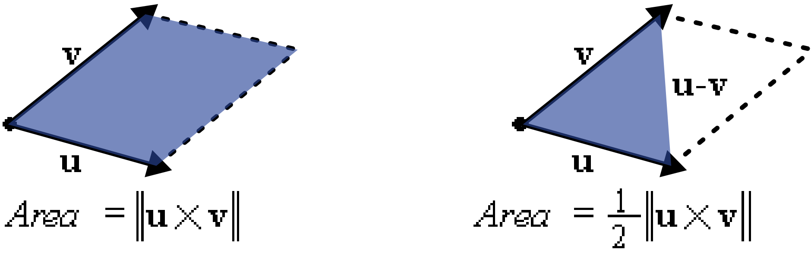

<p align="center">
	
	<br>
	<em>QR-Code scannen um dieses Dokument auf dem IPad zu öffnen</em>
</p>

1. <code>Korrekturen und Ergänzungen zu diesem Dokument sind erwünscht. Bitte fügen Sie diese in [Google Docs](https://docs.google.com/document/d/12Gqtnn5DdQmN6GDQs-ADqzZjTsvVcVF5w9dpGsSQXM4/edit?usp=sharing) ein. Ich werde versuchen, sie so schnell wie möglich zu integrieren.</code>
2. Die Formatierung der Formeln auf dem Handy absolut ekelhaft, daher empfehle ich, entweder auf einem Computer oder einem iPad zu lesen.

# Inhalt
- [Punkte](#punkte)
- [Lineare Gleichungen](#lineare-gleichungen)
- [Lineare Gleichungssysteme](#lineare-gleichungssysteme)
- [Lösen eines linearen Gleichungssystems](#lösen-eines-linearen-gleichungssystems)
- [Polynominterpolation](#polynominterpolation)
- [Kartesisches Koordinatensystem](#kartesisches-koordinatensystem)
- [Vektoren](#vektoren)
- [Skalarprodukt](#skalarprodukt)
- [Kreuzprodukt](#kreuzprodukt)
- [Geraden im dreidimensionalen Raum](#geraden-im-dreidimensionalen-raum)
- [Ebenen im dreidimensionalen Raum](#ebenen-im-dreidimensionalen-raum)
- [Strecke proportional aufteilen](#strecke-proportional-aufteilen)
- [Spiegelungen](#spiegelungen)

## Analytische Geometrie
**Analytische Geometrie:** Ein Teilgebiet der Mathematik, der algebraische Methoden nutzt, um geometrische Eigenschaften und Beziehungen in einem Koordinatensystem zu beschreiben. Analytische Geometrie ermöglicht die Lösung geometrischer Probleme durch algebraische Methoden.

# Punkte
- **2D-Punkt:** Ein Objekt in der Ebene, das durch ein geordnetes Paar von Zahlen $(x| y)$ dargestellt wird. Hierbei repräsentiert $x$ die horizontale Position und $y$ die vertikale Position im zweidimensionalen Raum. 
- **3D-Punkt:** Ein Objekt im Raum, das durch ein geordnetes Tripel von Zahlen $(x| y| z)$ charakterisiert wird. $x$, $y$ und $z$ repräsentieren die Positionen entlang der x-, y- und z-Achsen im dreidimensionalen Raum.
- Die Menge der Punkte kann wie folgt angegeben werden: $L = \\{(t \mid t - 5) \mid t \in \mathbb{R} \text{  beliebig} \\}$
# Lineare Gleichungen
Eine **lineare Gleichung** ist eine algebraische Gleichung, dessen beide Seiten nur aus einer Summe aus Konstanten oder Variablen(im ersten Potenz multipliziert durch konstanten) besteht. 

**Beispiel:** `ax + by + c = 0`, wobei `a`, `b`, und `c` konstante Werte sind und `x` und `y` Variablen.


# Lineare Gleichungssysteme
Ein **lineares Gleichungssystem** besteht aus zwei oder mehr linearen Gleichungen, die gemeinsame Variablen haben.

**Beispiel:**
```
2x - y = 5
 x + y = 7
```

# Lösen eines linearen Gleichungssystems
Beim Lösen eines linearen Gleichungssystems besteht das Ziel darin, die Werte für die Variablen zu finden, die alle Gleichungen des Systems gleichzeitig erfüllen. Am häufigsten wird zur Lösung linearer Gleichungssysteme das Substitutionsverfahren oder das Gauß-Verfahren verwendet. Substitutionsmethode passt für Gleichungssysteme mit zwei Variablen und Gauss-Verfahren für größere Systeme mit mehr Variablen.

### Substitutionsmethode
**Substitutionsmethode:** Ein algebraisches Verfahren zur Lösung linearen Gleichungssystems, indem der Wert einer Variablen aus einer Gleichung in andere Gleichungen eingesetzt wird. Dies vereinfacht das Gleichungssystem zu einer einzelnen Gleichung mit einer Variablen, die dann gelöst werden kann. Schritte der Substitutionsmethode:

1. **Isolieren einer Variablen:** Wähle eine der Gleichungen und löse sie nach einer Variablen auf.
3. **Einsetzen:** Ersetze die isolierte Variable in alle andere Gleichungen (Dies eliminiert die erste Gleichung aus dem System).
4. Wiederholen Sie die Schritte 1 und 2, bis entweder nur noch eine Gleichung übrig ist oder die verbleibenden Gleichungen keine Variablen mehr gemeinsam haben.
   - Wenn der Substitutionsprozess zu einer nicht wahren Gleichung (`1=0`, `3=-4`) führte, dann hat dieses Gleichungssystem keine Lösungen.
   - Wenn im Substitution Prozess eine der Gleichungen zu einer Ware Gleichung ohne Variablen kürzt (`1=1`, `0=0`), dann entfernen Sie diese Gleichung aus dem System, sie ist redundant.
5. **Lösen der neuen Gleichung:**
   - Wenn Sie nur noch eine Gleichung mit einer Variablen haben, lösen Sie diese. Auf diese Weise erhalten Sie den Wert einer der Variablen. Suchen Sie dann in den vorherigen Schritten die Gleichung, die die Variable enthält, deren Wert Sie gerade gelernt haben, und eine weitere Variable, ersetzen Sie den Wert und lösen Sie diese. Wiederholen Sie den letzten Schritt, bis Sie die Werte aller Variablen gefunden haben.
   - Wenn Sie eine Gleichung mit mehreren Variablen übrig haben, sind alle Werte der Variablen, die diese Gleichung erfüllen, Lösungen des Systems.

[weitere Informationen zu Substitutionsmethode](https://en.wikipedia.org/wiki/System_of_linear_equations#Elimination_of_variables)
## Gaußsches Eliminationsverfahren
Das **Gaußsche Eliminationsverfahren**, ist Verfahren zur Lösung linearer Gleichungssysteme. Es transformiert das System in eine obere Dreiecksform, von der aus die Lösungen leicht durch Rückwärtseinsetzen gefunden werden können.

#### Schritte des Gaußschen Eliminationsverfahrens
1. **Auswahl des führenden Elements**: Wähle das erste Element der ersten Spalte, das nicht null ist, als führendes Element.
2. **Zeilenanpassung**: Tausche nötigenfalls die Zeilen, sodass das führende Element in der aktuellen Zeile an der ersten Position steht.
3. **Elimination**: Nutze das führende Element, um alle Einträge unterhalb dessen auf null zu setzen. Subtrahiere dazu ein Vielfaches der führenden Zeile von den darunterliegenden Zeilen, sodass die Elemente unterhalb null werden.
4. **Wiederholung für die nächste Spalte**: Wiederhole die Schritte 1 bis 3 für die nächste Spalte und Zeile, bis das gesamte System auf eine obere Dreiecksform reduziert ist.
5. **Rückwärtseinsetzen**: Beginne bei der letzten Gleichung und löse sie nach der letzten Variablen auf. Setze diesen Wert in die vorherige Gleichung ein, um die nächste Variable zu finden, und fahre so fort, bis alle Variablen bestimmt sind.

 [detaillierte Beschreibung des Algorithmus](https://en.wikipedia.org/wiki/Gaussian_elimination)

## Polynomfunktion n-ten Grades
**Polynomfunktion n-ten Grades**: Eine Polynomfunktion n-ten Grades ist eine Funktion der Form $P(x) = a_nx^n + a_{n-1}x^{n-1} + \ldots + a_1x + a_0$, wobei $a_n, a_{n-1}, \ldots, a_1, a_0$ Koeffizienten sind und $a_n \neq 0$. 


# Polynominterpolation
Ein Polynom vom Grad $n$ kann durch $n+1$ beliebige Punkte $(x_1, y_1), (x_2, y_2), \ldots, (x_{n+1}, y_{n+1})$ eindeutig bestimmt werden, vorausgesetzt, dass keine zwei dieser Punkte dieselben $x$-Koordinaten haben (dass keine zwei Punkte übereinander liegen). [Video](https://www.youtube.com/watch?v=z1YUTRG3ngM)

## Schritte
1. **Aufstellen des Gleichungssystems**: Für jeden Punkt wird eine Gleichung der Form $a_nx_i^n + a_{n-1}x_i^{n-1} + \ldots + a_1x_i + a_0 = y_i$ erstellt.
2. **Lösen des Gleichungssystems**: Das resultierende lineare Gleichungssystem aus n+1 Gleichungen für die n+1 Unbekannten (die Koeffizienten $a_0, a_1, \ldots, a_n$) wird gelöst.

Die gleiche Methode kann auch verwendet werden, um ein Polynom n-ten Grades zu finden, das durch mehr als n + 1 Punkte verläuft. In diesem Fall funktioniert sie jedoch nicht für jeden Satz von Punkten.

Auch, wenn wir eine Polynomfunktion finden wollen, die nicht nur durch eine Reihe von Punkten verläuft, sondern an den Punkten auch bestimmte Eigenschaften aufweist, d. h. beispielsweise an einem der Punkte $(x_p| y_p)$ ein lokales Maximum hat. In diesem Fall erstellen wir auch ein System linearer Gleichungen, wobei wir die Gleichungen jetzt auf der Grundlage der Eigenschaften zusammenstellen, die die Funktion an diesen Punkten haben muss. Beispielsweise wissen wir für einen lokalen Maximumpunkt, dass die Funktion eine Ableitung gleich 0 haben muss und auch durch diesen Punkt verläuft. Das heißt, wir erhalten zwei Gleichungen: $f(x_p)=y_p$ und $f'(x_p)=0$ 


## Beispiel
Betrachten wir die Punkte $(1| 2), (2| 3), (3| 5)$. Ein Polynom 2-ten Grades soll durch diese Punkte bestimmt werden:
$P(x) = ax^2 + bx + c$

#### Aufstellen des Gleichungssystems
Setzen Sie die gegebenen Punkte in das Polynom ein:
``` math
\begin{align*}
a(1)^2 + b(1) + c &= 2 \\
a(2)^2 + b(2) + c &= 3 \\
a(3)^2 + b(3) + c &= 5
\end{align*}
```
Das ergibt das System:
```math
\begin{align*}
1a + 1b + 1c &= 2 \\
4a + 2b + 1c &= 3 \\
9a + 3b + 1c &= 5
\end{align*}
```
#### Lösen des Gleichungssystems
Dieses System kann nun mit Gaußsches Eliminationsverfahren gelöst werden. Nach Lösung erhält man die Koeffizienten $a$, $b$, und $c$, die das gesuchte Polynom definieren $a = 0.5$, $b = -0.5$, und $c = 2$, sodass das resultierende Polynom lautet: $P(x) = 0.5x^2 - 0.5x + 2$ Dieses Polynom verläuft durch alle drei gegebenen Punkte, was durch Einsetzen der $x$-Werte in $P(x)$ überprüft werden kann.


# Kartesisches Koordinatensystem
In einem dreidimensionalen kartesischen Koordinatensystem wird jedes Punkt durch drei Zahlenwerte beschrieben. Komplexere Objekte können durch Gleichungen dargestellt werden, deren Lösungsmengen alle Punkte umfassen, die zu diesen Objekten gehören. In einem zweidimensionalen Koordinatensystem können Sie alle Längen und Winkel direkt von der Zeichnung auf Papier messen und sie werden korrekt sein. Ein Blatt Papier kann den dreidimensionalen Raum jedoch nicht vollständig abbilden. Wenn dreidimensionale Objekte auf Papier gezeichnet werden, sind sie daher nicht geeignet, um Länge, Winkel und die meisten anderen Eigenschaften von diesen Objekte zu messen. Dafür ist die analytische Geometrie erforderlich.

<p align="center">
	
	<br>
	<em>2d Kartesisches Koordinatensystem</em>
</p>
<p align="center">
	
	<br>
	<em>3d Kartesisches Koordinatensystem</em>
</p>

# Vektoren
Ein **Vektor** ist ein mathematisches Objekt, das eine Größe und eine Richtung besitzt. Mathematisch wird ein Vektor im Raum durch seine Koordinaten in der Form $(x_1, x_2, x_3)$ dargestellt, wobei $x_1, x_2, x_3$ die Komponenten des Vektors entlang der $x$-, $y$-, und $z$-Achsen sind.

## **Freier Vektor**
Ein **freier Vektor** ist ein Vektor, der unabhängig von seiner Position im Raum definiert ist. Das bedeutet, dass seine Eigenschaften wie Richtung und Länge gleich bleiben, unabhängig davon, wo er im Koordinatensystem platziert wird.

## **Ortsvektor**
Ein **Ortsvektor** ist ein Vektor, der vom Ursprung des Koordinatensystems zu einem Punkt P führt. Er beschreibt die Position dieses Punktes im Raum. In der Regel wird ein Ortsvektor als $\vec{OP}$ notiert, wobei $O$ der Ursprung und $P$ der Endpunkt des Vektors ist.

## Schreibweisen für Vektoren
Vektoren können auf verschiedene Weisen dargestellt werden:

- **Mit einem Pfeil über dem Buchstaben:** $\vec{a}$

- **Vektor von einem Punkt zu einem anderen Punkt**: Gegeben zwei Punkte $A = (a_1| a_2| a_3)$ und $B = (b_1| b_2| b_3)$, ist der Vektor
  $\vec{AB} = (b_1 - a_1, b_2 - a_2, b_3 - a_3)$.

- **Mit eine vertikale Klammer:**
```math
\begin{pmatrix}
a_1 \\
a_2 \\
a_3
\end{pmatrix}
```

## Addition von Vektoren
**Vektoraddition:** Die Addition zweier Vektoren $\vec{a} = (a_1, a_2, a_3)$ und $\vec{b} = (b_1, b_2, b_3)$ erfolgt komponentenweise. Das Ergebnis ist ein neuer Vektor $\vec{c} = (a_1 + b_1, a_2 + b_2, a_3 + b_3)$.

#### Beispiel
Seien $\vec{a} = (3, 4, 5)$ und $\vec{b} = (1, 0, 2)$, dann ist $\vec{c} = \vec{a} + \vec{b} = (3+1, 4+0, 5+2) = (4, 4, 7)$.

## Subtraktion von Vektoren
**Vektorsubtraktion:** Die Subtraktion von Vektor $\vec{b}$ von Vektor $\vec{a}$ erfolgt ebenfalls komponentenweise: $\vec{c} = \vec{a} - \vec{b} = (a_1 - b_1, a_2 - b_2, a_3 - b_3)$.

#### Beispiel
Für $\vec{a} = (3, 4, 5)$ und $\vec{b} = (1, 0, 2)$ ist $\vec{c} = \vec{a} - \vec{b} = (3-1, 4-0, 5-2) = (2, 4, 3)$.

### Streckung von Vektoren
**Vektorstreckung (Skalierung):** Ein Vektor $\vec{a} = (a_1, a_2, a_3)$ kann durch eine Skalierung mit einem Skalar $k$ gestreckt werden, wodurch ein neuer Vektor $\vec{b} = k\vec{a} = (ka_1, ka_2, ka_3)$ entsteht.

#### Beispiel
Für $\vec{a} = (3, 4, 5)$ und $k = 2$ ist $\vec{b} = 2\vec{a} = (2\cdot3, 2\cdot4, 2\cdot5) = (6, 8, 10)$.

## Betrag eines Vektors

Der **Betrag eines Vektors** $\vec{v}$, oft auch als die Länge oder Magnitude des Vektors bezeichnet, misst die "Größe" des Vektors. Für einen Vektor $\vec{v} = (v_1, v_2, v_3)$ im dreidimensionalen Raum wird der Betrag $|\vec{v}|$ durch die folgende Formel bestimmt:

```math
|\vec{v}| = \sqrt{v_1^2 + v_2^2 + v_3^2}
```

#### **Beispiel**
Betrachten Sie den Vektor $\vec{v} = (3, 4, 12)$. Der Betrag dieses Vektors wird wie folgt berechnet:

```math
|\vec{v}| = \sqrt{3^2 + 4^2 + 12^2} = \sqrt{9 + 16 + 144} = \sqrt{169} = 13
```


# Skalarprodukt
**Skalarprodukt**: Das Skalarprodukt zweier Vektoren $\vec{a}$ und $\vec{b}$ wird definiert als:

$$ \vec{a} \cdot \vec{b} = |\vec{a}| |\vec{b}| \cos(\theta) $$

wobei $\theta$ der kleinere Winkel zwischen den Vektoren $\vec{a}$ und $\vec{b}$ ist.

Das Skalarprodukt von zwei dreidimensionalen Vektoren lässt sich auch mittels der Komponentenformel berechnen:

$$ \vec{a} \cdot \vec{b} = a_{1} b_{1} + a_{2} b_{2} + a_{3} b_{3} $$

wobei $(a_{1}, a_{2}, a_{3})$ und $(b_{1}, b_{2}, b_{3})$ die kartesischen Koordinaten der Vektoren $\vec{a}$ bzw. $\vec{b}$ sind.

### Eigenschaften des Skalarprodukts
- **Kommutativität**: $\vec{a} \cdot \vec{b} = \vec{b} \cdot \vec{a}$
- **Distributivität über Vektoraddition**: $\vec{a} \cdot (\vec{b} + \vec{c}) = \vec{a} \cdot \vec{b} + \vec{a} \cdot \vec{c}$
- **Assoziativität mit Skalaren**: $(k \vec{a}) \cdot \vec{b} = k (\vec{a} \cdot \vec{b})$
- **Orthogonalität**: Zwei Vektoren sind orthogonal (senkrecht zueinander), wenn ihr Skalarprodukt null ist, $\vec{a} \cdot \vec{b} = 0$.

### Formel für die Länge eines Vektors
Die Länge (oder der Betrag) eines Vektors $\vec{v}$, kann man berechnen indem man Wurzel von Skalarprodukt von dem Vektor mit sich selbst kalkuliert:

$$ |\vec{v}| = \sqrt{\vec{v} \cdot \vec{v}} $$

### Verwendung des Skalarprodukts zur Winkelberechnung
Das Skalarprodukt kann auch verwendet werden, um den Winkel $\theta$ zwischen zwei Vektoren zu berechnen. Die Formel hierfür ist:

$$ \theta = \cos^{-1} \left( \frac{\vec{a} \cdot \vec{b}}{|\vec{a}| |\vec{b}|} \right) $$


# Kreuzprodukt

[Video](https://studyflix.de/mathematik/kreuzprodukt-vektorprodukt-2254)

### Definition und Formel im dreidimensionalen Raum
<p align="center">
	
	<br>
	<em>Rechte-Hand-Regel</em>
</p>

**Kreuzprodukt**: Das Kreuzprodukt zweier Vektoren $\vec{a}$ und $\vec{b}$ im dreidimensionalen Raum wird definiert als ein Vektor $\vec{c}$, der senkrecht zu beiden Vektoren steht und dessen Länge dem Flächeninhalt des Parallelogramms entspricht, das von $\vec{a}$ und $\vec{b}$ aufgespannt wird. Die Richtung von $\vec{c}$ wird durch die Rechte-Hand-Regel bestimmt.

Das Kreuzprodukt wird berechnet mit der Formel: 

```math
$$ \vec{a} \times \vec{b} = \begin{pmatrix}
a_{2} b_{3} - a_{3} b_{2} \\
a_{3} b_{1} - a_{1} b_{3} \\
a_{1} b_{2} - a_{2} b_{1}
\end{pmatrix} $$
```

wobei $(a_{1}, a_{2}, a_{3})$ und $(b_{1}, b_{2}, b_{3})$ die kartesischen Koordinaten der Vektoren $\vec{a}$ bzw. $\vec{b}$ sind.

### Eigenschaften des Kreuzprodukts
- **Antikommutativität**: $\vec{a} \times \vec{b} = -(\vec{b} \times \vec{a})$
- **Distributivität über Vektoraddition**: $\vec{a} \times (\vec{b} + \vec{c}) = \vec{a} \times \vec{b} + \vec{a} \times \vec{c}$
- **Skalarfaktor**: $k (\vec{a} \times \vec{b}) = (k \vec{a}) \times \vec{b} = \vec{a} \times (k \vec{b})$

### Länge des Kreuzprodukts
Die Länge (oder der Betrag) des Kreuzprodukts $\vec{a} \times \vec{b}$ ist gleich:

$$ |\vec{a} \times \vec{b}| = |\vec{a}| |\vec{b}| \sin(\theta) $$

wobei $\theta$ der Winkel zwischen den Vektoren $\vec{a}$ und $\vec{b}$ ist.

### Verwendung des Kreuzprodukts zur Flächenberechnung

<p align="center">
	
	<br>
</p>

Das Kreuzprodukt kann verwendet werden, um die Fläche eines Parallelogramms zu berechnen, das von zwei Vektoren umschlossen wird. Für ein Dreieck, das von den Vektoren $\vec{a}$ und $\vec{b}$ aufgespannt wird, beträgt die Fläche die Hälfte des Betrags des Kreuzprodukts:

$$ \text{Fläche des Dreiecks} = \frac{1}{2} |\vec{a} \times \vec{b}| $$


# Geraden im dreidimensionalen Raum

## Definition einer Gerade

- **Stützpunkt $P$:** Ein Punkt, durch den die Gerade verläuft.
- **Stützvektor $\vec{p}$:** Ortsvektor aus dem Ursprung zu dem Stützpunkt.
- **Richtungsvektor $\vec{v}$:** Gibt die Richtung der Geraden an.

Die **Parameterform** einer Geraden ist gegeben durch die Gleichung:

$$\vec{r}(t) = \vec{p} + t\vec{v}$$

wobei $t \in \mathbb{R}$ der Parameter ist.

Sei $\mathbf{p} = (1, 2, 3)$ und $\mathbf{v} = (4, 5, 6)$. Dann lautet die Gleichung der Geraden:

$$\mathbf{r}(t) = (1, 2, 3) + t(4, 5, 6)$$
 
 ## Punktprobe
 Für den Punkt $\vec{q} = (5, 7, 9)$ prüft man:

 $$(5, 7, 9) = (1, 2, 3) + t(4, 5, 6)$$

 Daraus folgt durch Komponentenvergleich und Lösung des Gleichungssystems, dass $t = 1$ eine Lösung ist, also liegt $\vec{q}$ auf der Geraden.

## Relativen Lage von Geraden im Raum
[Video](https://studyflix.de/mathematik/lagebeziehungen-von-geraden-5826):
1. **echt Parallele Geraden:** Zwei Geraden werden als echt parallel bezeichnet, wenn sie parallel, aber nicht identisch sind. Zwei Geraden sind echt parallel wenn ihre Richtungsvektoren vielfacher voneinander sind aber Stützpunkt von einer gerade liegt nicht auf der andere gerade (dies kann man mit der Punktprobe nachweisen).
2. **parallele und identische Geraden:** Zwei Geraden sind identisch und parallel, wenn ihre Richtungsvektoren vielfacher voneinander sind und Stützpunkt von einer gerade liegt auf der andere gerade.
3. **Geraden schneiden sich**, wenn ihre Richtungsvektoren sind nicht vielfache voneinander und es existieren zwei Punkt im Raum der zu beiden Geraden gehört.
4. Geraden werden als **windschief** bezeichnet, wenn sie sich weder schneiden noch parallel zueinander sind.

#### Beispiel

Betrachten wir zwei Geraden:

- $\vec{r}_1(t) = (1, 2, 3) + t(4, 5, 6)$
- $\vec{r}_2(s) = (-1, -2, -3) + s(2, 2.5, 3)$

 Diese Geraden sind parallel, da $\vec{v}_2 = 0.5\vec{v}_1$ ( $\vec{v}_1$ und  $\vec{v}_2$ sind Richtungsvektoren von geraden $\vec{r}_1(t)$, $\vec{r}_2(t)$ ). Sie haben keinen Schnittpunkt, da sie nicht identisch sind.


## Schnittpunkt zweier Geraden
Um den Schnittpunkt von zwei Geraden Geraden $a: \vec{s_a} + t\cdot \vec{r_a}$ und $b: \vec{s_b} + s\cdot \vec{r_b}$ zu bestimmen muss man:
- Ein lineares Gleichungssystem aufstellen: $\vec{s_a} + t\cdot \vec{r_a} =  \vec{s_b} + s\cdot \vec{r_b}$
- Diese nach $t$ und $s$ lösen.
- Überprüfen mit Einsätzen der $t$ und $s$ ob alle Gleichungen des Systems wahl sind.
-  $t$ oder $s$ in ihre entsprechende der Geradengleichung reinsetzen um den Schnittpunkt Koordinaten zu bekommen.


## Lotfußpunkt auf eine Gerade

Den Lotfußpunkt $L$ (Ortsvektor gleich $\vec{l}$) von Punkt $P$ (Ortsvektor gleich $\vec{p}$) auf eine Gerade $g: \vec{g} = \vec{s} + \cdot \vec{r}$ , kann man entweder mit dieser Formel berechnen:

$$ \vec{l} = \left(\frac{\vec{r} \cdot (\vec{p}-\vec{s})} {\vec{r} \cdot \vec{r}}\right) \vec{r} + \vec{s} $$


oder indem man eine Hilftsebene erstellt die normal zu der Gerade $g$ ist und durch Punkt $P$ verläuft und danach den Schnittpunkt von dieser Hilftsebene und der Gerade $g$ findet für (Schnittpunkt gerade Ebene sehe Algorithmus unten).
**(mir persönlich gefällt mir die Methode mit der Formel)*

## Abstand Punkt-Gerade
Um den Abstand zwischen einem Punkt und eine Gerade zu berechnen muss man zuerst den Lotfußpunkt finden und danach Abstand zwischen dem Punkt und dem Lotfußpunkt berechnen.

## Abstand Gerade-Gerade

[Video](https://studyflix.de/mathematik/abstand-gerade-gerade-2007)

Der Algorithmus zur Berechnung des Abstands zwischen zwei Geraden $a: \vec{s_a} + t\cdot \vec{r_a}$ und $b: \vec{s_b} + s\cdot \vec{r_b}$ unterscheidet sich je nach der relativen Lage dieser Linien im Raum:
- Wenn sich die Geraden schneiden oder sind identich, ist der Abstand gleich Null.
- Wenn Geraden echt parallel sind dann muss man von dem Stützpunkt von Gerade $a$ den Lotfußpunkt auf die Gerade $b$ befinden und danach Abstand zwischen Stützpunkt von $a$ und dem Lotfußpunkt finden.
- Wenn gerade ein windschiff zueinander sind, muss man zuerst mit dem Kreuzprodukt einen Vektor \vec{n}  finden der orthogonal zu dem Richtungsvektor von gerade $a$ und Richtungsvektor von Gerade $b$ ist, dann kann man Abstand $d$ zwischen denen mit dieser Formel berechnen:

$$d =  \frac{\vert (\vec{s_a} - \vec{s_b}) \cdot \vec{n} \vert}{\vert \vec{n} \vert} $$


**(Beachten Sie, dass diese Formel der Formel zur Berechnung des Abstands zwischen einem Punkt und einer Ebene gleich ist.)*


# Ebenen im dreidimensionalen Raum

Eine **Ebene** ist eine zweidimensionale Fläche im dreidimensionalen Raum, die durch mindestens drei nicht auf einer Geraden liegende Punkte definiert werden kann.

Übersicht formen von Ebenengleichungen(optional): [Video](https://studyflix.de/mathematik/ebenengleichung-5791)
## Parameterform der Ebene

[Video](https://studyflix.de/mathematik/parameterform-2402)

Die **Parameterform** einer Ebene wird durch einen Punkt und zwei nicht parallele Richtungsvektoren definiert. Sie lautet:

$$\vec{x} = \vec{p} + r\vec{u} + s\vec{v}$$

- $\vec{p}$ ist der Stützvektor (Ortsvektor aus dem Ursprung zu einem Punkt auf der Ebene),
- $\vec{u}$ und $\vec{v}$ sind die Spannvektoren der Ebene,
- $r$ und $s$ sind Parameter.

#### Beispiel

Gegeben sei der Punkt $\vec{p} = (1, 2, 3)$ und die Vektoren $\vec{u} = (4, 0, 0)$ und $\vec{v} = (0, 5, 0)$. Die Parameterform der Ebene ist dann:

$$\vec{x} = (1, 2, 3) + r(4, 0, 0) + s(0, 5, 0)$$

## Normalenform der Ebene

[Video](https://studyflix.de/mathematik/normalenform-2404)

Die **Normalenform** der Ebene verwendet einen Normalenvektor, der senkrecht zur Ebene steht. Sie wird definiert als:

$$\vec{n} \cdot (\vec{x} - \vec{p}) = 0$$

- $\vec{n}$ ist der Normalenvektor der Ebene,
- $\vec{x}$ ist ein beliebiger Punkt auf der Ebene,
- $\vec{p}$ ist ein spezifischer Punkt auf der Ebene (Stützvektor).

#### Beispiel

Für die Ebene mit dem Normalenvektor $\vec{n} = (1, 1, 1)$ und dem Punkt $\vec{p} = (1, 2, 3)$ lautet die Normalenform:

$$(1, 1, 1) \cdot ((x_1, x_2, x_3) - (1, 2, 3)) = 0$$

## Koordinatenform der Ebene

[Video](https://studyflix.de/mathematik/koordinatenform-2403)

Die **Koordinatenform** der Ebene ist eine algebraische Darstellung, die direkt aus der Normalenform abgeleitet wird, indem das Skalarprodukt ausmultipliziert und umgeformt wird. Sie lautet:

$$a x_1 + b x_2 + c x_3 = d$$

- $a, b, c$ sind die Komponenten des Normalenvektors,
- $d$ ist der Skalar, der sich ergibt, indem man den Normalenvektor mit dem Stützvektor skalar multipliziert.

#### Beispiel

Die Koordinatenform der Ebene mit dem Normalenvektor $\vec{n} = (1, 1, 1)$ und dem Punkt $\vec{p} = (1, 2, 3)$ ist:

$$1x_1 + 1x_2 + 1x_3 = 6$$

Durch diese verschiedenen Formen der Gleichungen lassen sich Ebenen im Raum auf vielfältige Weise mathematisch beschreiben und untersuchen.

## Normalenvektor bestimmen
[Video](https://studyflix.de/mathematik/normalenvektor-2431)

## Umwandlung von Parameterform zu Normalenform der Ebene

Um die Parameterform einer Ebene in die Normalenform umzuwandeln, benötigt man den Normalenvektor der Ebene. Dieser kann durch das Kreuzprodukt der Richtungsvektoren der Ebene gefunden werden, die in der Parameterform angegeben sind.

#### Schritte
1. **Bestimmen der Richtungsvektoren:** Seien $\vec{u}$ und $\vec{v}$ die Spannvektoren der Ebene in Parameterform.
2. **Kreuzprodukt bilden:** Der Normalenvektor $\vec{n}$ ist das Ergebnis des Kreuzprodukts $\vec{u} \times \vec{v}$.
3. **Normalenform aufstellen:** Mit dem Stützpunkt $\vec{p}$ und dem Normalenvektor $\vec{n}$ lautet die Normalenform $\vec{n} \cdot (\vec{x} - \vec{p}) = 0$.

#### Beispiel
Gegeben ist die Ebene in Parameterform:

$$\vec{x} = (1, 1, 1) + r(1, 0, 1) + s(0, 1, 1)$$

**Schritte**:
1. **Spannvektoren bestimmen**: $\vec{u} = (1, 0, 1)$ und $\vec{v} = (0, 1, 1)$.
2. **Normalenvektor berechnen**: $\vec{n} = \vec{u} \times \vec{v} = (1, -1, 1)$.
3. **Normalenform aufstellen**: $\vec{n} \cdot (\vec{x} - \vec{p}) = (1, -1, 1) \cdot (\vec{x} - (1, 1, 1)) = 0$.
   $$x_1 - x_2 + x_3 - 1 = 0$$
   


## Umwandlung von Normalenform zu Koordinatenform der Ebene
#### Schritte
1. **Identifizierung des Normalenvektors**: Der Normalenvektor $\vec{n}$ ist bereits gegeben.
2. **Berechnung von $d$**: Ermitteln Sie $d = \vec{n} \cdot \vec{p}$.
3. **Formulierung der Koordinatenform**: Nutzen Sie $\vec{n}$ und $d$ in der Gleichung $a x_1 + b x_2 + c x_3 = d$.

#### Beispiel
Nutzen wir die gleiche Ebene wie oben:
1. **Normalenvektor**: Bereits berechnet $\vec{n} = (1, -1, 1)$.
2. **Berechnung von $d$**: $d = \vec{n} \cdot \vec{p} = (1, -1, 1) \cdot (1, 1, 1) = 1$.
3. **Koordinatenform aufstellen**: 
   $$x_1 - x_2 + x_3 = 1$$


## Umwandlung von Parameterform zu Koordinatenform der Ebene

[Video](https://studyflix.de/mathematik/parameterform-in-koordinatenform-3658)

#### Schritte
1. **Berechnung des Normalenvektors**: Wie zuvor, berechnen Sie $\vec{n} = \vec{u} \times \vec{v}$.
2. **Berechnung von $d$**: Bestimmen Sie $d$ durch das Skalarprodukt des Normalenvektors mit dem Stützvektor, $d = \vec{n} \cdot \vec{p}$.
3. **Aufstellen der Koordinatenform**: Verwenden Sie die Komponenten von $\vec{n}$ und $d$ in der Gleichung $a x_1 \cdot n_1 + b x_2 \cdot n_2 + x_3 \cdot n_3 = d$.

#### Beispiel
Nutzen wir die gleiche Ebene wie oben:
**Schritte**:
1. **Normalenvektor**: Bereits berechnet $\vec{n} = (1, -1, 1)$.
2. **Berechnung von $d$**: $d = \vec{n} \cdot \vec{p} = (1, -1, 1) \cdot (1, 1, 1) = 1$.
3. **Koordinatenform aufstellen**: 
   $$x_1 - x_2 + x_3 = 1$$


## Umwandlung von Normalenform zu Parameterform der Ebene
#### Schritte
1. **Auswahl zweier unabhängiger Spannvektoren**: Wählen Sie zwei Vektoren $\vec{u}$ und $\vec{v}$, die orthogonal zu $\vec{n}$ sind. man kann die Vektoren durch "raten" bestimmen oder durch die Formel:
	- $\vec{u} = (n_2, -n_1, 0)$
 	- $\vec{v} = (0 ,  n_3, -n_2)$
2. **Aufstellen der Parameterform**: Nutzen Sie $\vec{p}$, $\vec{u}$ und $\vec{v}$ in der Gleichung $\vec{x} = \vec{p} + r\vec{u} + s\vec{v}$.

#### Beispiel
Gegeben sei die Normalenform der Ebene:
$$\vec{n} \cdot (\vec{x} - (1, 0, 0)) = 0$$ mit $\vec{n} = (0, 1, 0)$.
**Schritte**:
1. **Spannvektoren auswählen**: $\vec{u} = (1, 0, 0)$ und $\vec{v} = (0, 0, -1)$.
2. **Parameterform aufstellen**:
   $$\vec{x} = (1, 0, 0) + r(1, 0, 0) + s(0, 0, -1)$$

## Umwandlung von Koordinatenform zu Parameterform der Ebene

[Video](https://studyflix.de/mathematik/koordinatenform-in-parameterform-3668)

#### Schritte
1. **Berechnung des Normalenvektors**: Aus der Koordinatenform $a x_1 + b x_2 + c x_3 = d$ ist $\vec{n} = (a, b, c)$.
2. **Bestimmung eines Punktes auf der Ebene**: Lösen Sie die Gleichung für ein spezifisches $x_1, x_2, x_3$, um einen Punkt $\vec{p}$ auf der Ebene zu finden. Oft ist das am einfachsten, wenn man sagt, dass $x_1$ und $x_2$ gleich Null sind und nach $x_3$ die Gleichung auflöst.
3. **Auswahl zweier unabhängiger Spannvektoren**: Suchen Sie zwei Vektoren $\vec{u}$ und $\vec{v}$, die orthogonal zu $\vec{n}$ sind.
4. **Formulierung der Parameterform**: Verwenden Sie $\vec{p}$, $\vec{u}$ und $\vec{v}$ in der Gleichung $\vec{x} = \vec{p} + r\vec{u} + s\vec{v}$.

#### Beispiel
Gegeben sei die Koordinatenform der Ebene:
$$x_1 + x_2 + x_3 = 3$$
1. **Normalenvektor bestimmen**: $\vec{n} = (1, 1, 1)$.
2. **Einen Punkt auf der Ebene finden**: Wählen Sie $x_1 = 1$, $x_2 = 1$, dann ist $x_3 = 1$.
   $$\vec{p} = (1, 1, 1)$$
3. **Spannvektoren auswählen**: $\vec{u} = (-1, 1, 0)$ und $\vec{v} = (-1, 0, 1)$.
4. **Parameterform aufstellen**:
   $$\vec{x} = (1, 1, 1) + r(1, -1, 0) + s(0, 1, -1)$$

## Relative Lage von Ebenen
zwei Ebenen können zueinander:
- **echt Parallel** sind Ebenen, wenn nicht identisch sind und die keinen Schnittpunkt haben. Zwei Ebenen sind parallel wenn ihre Normalenvektoren vielfachen voneinander sind (aka: ihre Koordinatenformen sind vielfachen voneinander bis auf eine konstante).
- **Parallel und Identisch** sind zwei oder mehr Ebenen, die exakt dieselben Punkte enthalten. Dies bedeutet, dass ihre Normalenvektoren vielfachen voneinander und und Stützpunkt einer Ebene liegt auf der andere Ebene sind(aka: ihre Koordinatenformen sind vielfachen voneinander).
- **sich schneidend** sind Ebenen, die sich in einer Linie schneiden. Das passiert immer wenn ihre Normalenvektoren sind nicht vielfachen voneinander(aka: Normalenvektoren seigen in verschiedene Richtungen).

## Relative Lage von Gerade zu Ebenen
- **echt Parallel** Eine Gerade ist parallel zu einer Ebene, wenn der Richtungsvektor der Geraden orthogonal zum Normalenvektor der Ebene ist aber der Stützpunkt der gerade ist nicht in der Ebene.
- **Gerade liegt in einer Ebene**, wenn ihr Richtungsvektor orthogonal zu dem Normalenvektor von der Ebene und der Stützpunkt liegt in der Ebene.
- **Gerade schneidet eine Ebene**, wenn ihr Richtungsvektor nicht orthogonal zum Normalenvektor der Ebene ist.


## Berechnung des Schnittpunktes einer Geraden mit einer Ebene

[Video](https://studyflix.de/mathematik/schnittpunkt-gerade-ebene-4757)

Betrachten wir den Schnittpunkt der Geraden $g$ mit der Ebene $E$, welcher der Punkt ist, an dem die Gerade die Ebene durchdringt. Gegeben sind die Gerade $g$ und die Ebene $E$ wie folgt:

```math

g: \vec{x} = \left(\begin{array}{c}
1 \\
2 \\
3
\end{array}\right) + r \left(\begin{array}{c}
1 \\
0 \\
1
\end{array}\right), \quad E: 2 x_1 + 2 x_2 - 3 x_3 = 20
```

Folgen Sie diesen Schritten, um den Schnittpunkt zu ermitteln:

#### Schritt 1: Formulierung der Geradengleichung $g$
Fassen Sie die Geradengleichung in einer Matrix zusammen:

```math
\left(\begin{array}{c}
1 + r \\
2 \\
3 + r
\end{array}\right) = \left(\begin{array}{c}
x_1 \\
x_2 \\
x_3
\end{array}\right)
```


#### Schritt 2: Einsetzen in die Ebenengleichung $E$
Setzen Sie die Parameter der Geradengleichung in die Ebenengleichung ein:

```math
2 \cdot (1 + r) + 2 \cdot 2 - 3 \cdot (3 + r) = 20
```

#### Schritt 3: Auflösen nach dem Parameter $r$
Lösen Sie die Gleichung nach $r$ auf:

```math
2(1 + r) + 4 - 3(3 + r) = 20 \implies 2 + 2r + 4 - 9 - 3r = 20 \implies r = -23
```

#### Schritt 4: Berechnung des Schnittpunktes $S$
Setzen Sie den ermittelten Wert für $r$ in die Geradengleichung $g$ ein:

```math
\vec{S} = \left(\begin{array}{c}
1 \\
2 \\
3
\end{array}\right) + (-23) \left(\begin{array}{c}
1 \\
0 \\
1
\end{array}\right) = \left(\begin{array}{c}
-22 \\
2 \\
-20
\end{array}\right)
```

#### Schritt 5: Schnittpunkt $S$ ablesen
Der Schnittpunkt $S$ der Geraden $g$ mit der Ebene E ist $S = (-22, 2, -20)$. 

## Abstand Punkt Ebene
Abstand $d$ zwischen bene in Normalform ( $E: (\vec{x} - \vec{a}) \cdot \vec{n} = 0$ ), und einen Punkt $P$ (Ortsvektor gleich $\vec{p}$) ist gleich:

$$ d = \frac{\vert (\vec{p} - \vec{a}) \cdot \vec{n} \vert}{\vert \vec{n} \vert}$$

## Lotfußpunkt auf eine Ebene

Den Lotfußpunkt $L$ von Punkt $P$ auf eine Ebene in Normalform ( $E: (\vec{x} - \vec{a}) \cdot \vec{n} = 0$ ), berechnet sich wie folgt:
1. Erstellen Sie eine Hilfsgerade mit dem Stützpunkt $P$ und Richtungsvektor \vec{n} (wobei $P$ ist der Punkt von dem wir Lotfußpunkt finden wollen und $\vec{n}$ ist Normalvektor der Ebene)
2. Finden Sie den Schnittpunkt von der Hilfsgerade und Ebene $E$ dieser Punkt ist der Lotfußpunkt $L$ (hierfür können Sie den oben angegebenen Algorithmus verwenden).


## Winkel Ebene-Gerade
Um den Schnittwinkel $\theta$ zwischen Gerade $g$ (mit Richtungsvektor $\vec{r}$) und die Ebene $E$(mit Normalenvektor $\vec{n}$) zu berechnen, können Sie die folgende Formel verwenden:

$$ \theta = \sin^{-1} \left( \frac{\vec{r} \cdot \vec{n}}{|\vec{n}| |\vec{r}|} \right) $$


# Strecke proportional aufteilen

Hat man zwei Punkte $A$ (Ortsvektor gleich $\vec{a}$) und $B$ (Ortsvektor gleich $\vec{b}$) und will man ein drittes Punkt auf Strecke zwischen denen so setzen dass der Abstand von $C$ zu $A$ $= \vert \vec{CA} \vert$ und Abstand von $C$ zu $B$ $= \vert \vec{CB} \vert$ hatten die folgende Proportion zueinander:

$$ \frac{\vert \vec{CA} \vert}{\vert \vec{CB} \vert} = \frac{α}{β}$$

 dann lautet die Formel für Koordinaten von Punkt C:

 $$ (\vec{b}-\vec{a})\cdot \frac{α}{β+α} + \vec{a} = \vec{a} \cdot \frac{β}{β+α} + \vec{b} \cdot \frac{α}{β+α}$$


 # Spiegelungen

 ### Spiegelung an einem Punkt
Um einen Punkt $A$ an einem Punkt $Z$ zu spiegeln verwendent man die folgende Gleichung:

$$
\overrightarrow{OA'} = \overrightarrow{OA} + 2 \cdot \overrightarrow{AZ}
$$

- $A'$ = Gespiegelter Punkt  
- $A$ = Zu spiegelnder Punkt  
- $Z$ = Symmetriepunkt

### Spiegelung an einer Gerade
Um einen Punkt $A$ an einer Gerade zu spiegeln soll man zuerst den Lotfußpunkt von Punkt $A$ auf der gerade finden und danach den Punkt $A$ um den Lotfußpunkt spiegeln.

### Spiegelung an einer Ebene
Dasselbe wie bei Spiegelung an einer Gerade zuerst Lotfußpunkt finden danach um den Lotfußpunkt Spiegel.


 

 

 


